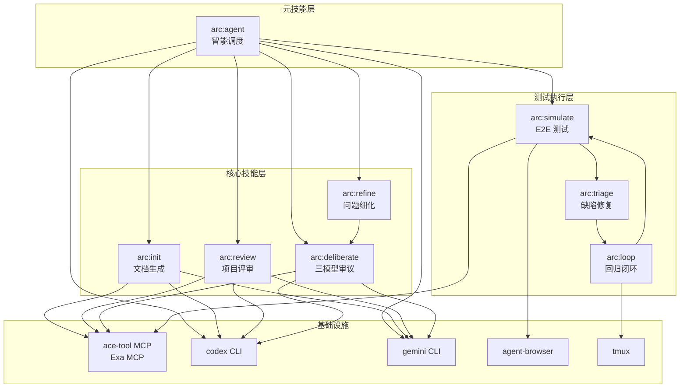

# Skills 仓库架构分析（Claude 视角）

> 输入来源：
> - `/Users/iluwen/Documents/Code/Skills/.arc/init/context/project-snapshot.md`
> - `/Users/iluwen/Documents/Code/Skills/.arc/init/context/generation-plan.md`
> - 项目 SKILL.md 文件深度阅读
>
> 分析时间：2026-02-24

## 1. 项目愿景

Skills 仓库是一个 **Claude Code Skills 插件集合**，采用 `arc:` 命名空间，为 Claude Code CLI 提供专业化的工作流扩展能力。核心理念是：

- **技能即文档**：每个 Skill 由 `SKILL.md` 定义，Markdown 即可执行规范
- **三模型协作**：Claude（架构/综合）、Codex（后端/工程）、Gemini（前端/DX）各司其职
- **工作流编排**：从需求理解到代码实现的全链路自动化

## 2. 架构总览

### 2.1 分层架构

```
┌─────────────────────────────────────────────────────────────┐
│                    用户交互层                                │
│         Claude Code CLI /arc:<skill> 命令                   │
└─────────────────────────────────────────────────────────────┘
                              │
┌─────────────────────────────────────────────────────────────┐
│                    调度层（元技能）                           │
│  arc:agent ─── 需求分析 → Skill 路由 → 模型调度 → 结果整合   │
└─────────────────────────────────────────────────────────────┘
                              │
┌─────────────────────────────────────────────────────────────┐
│                    核心技能层                                │
│  ┌──────────┐ ┌──────────┐ ┌──────────┐ ┌──────────┐       │
│  │arc:init  │ │arc:review│ │arc:      │ │arc:      │       │
│  │          │ │          │ │deliberate│ │refine    │       │
│  │文档生��  │ │项目评审  │ │三模型审议│ │问题细化  │       │
│  └──────────┘ └──────────┘ └──────────┘ └──────────┘       │
└─────────────────────────────────────────────────────────────┘
                              │
┌─────────────────────────────────────────────────────────────┐
│                    测试执行层                                │
│  ┌──────────┐ ┌──────────┐ ┌──────────┐                    │
│  │arc:      │ │arc:      │ │arc:loop  │                    │
│  │simulate  │ │triage    │ │          │                    │
│  │E2E 测试  │ │缺陷修复  │ │回归闭环  │                    │
│  └──────────┘ └──────────┘ └──────────┘                    │
└─────────────────────────────────────────────────────────────┘
                              │
┌─────────────────────────────────────────────────────────────┐
│                    基础设施层                                │
│  Python 脚本 │ MCP 工具 │ 外部 CLI (codex/gemini/openspec)  │
└─────────────────────────────────────────────────────────────┘
```

### 2.2 核心抽象

| 抽象 | 定义 | 示例 |
|------|------|------|
| **Skill** | 一组结构化的工作流定义，包含 frontmatter 元数据和可执行指令 | `simulate/SKILL.md` |
| **Phase** | Skill 内部的执行阶段，有明确的输入输出 | Phase 1: 深度扫描 |
| **Model Role** | 模型的职责角色，决定任务分配 | Claude=架构师, Codex=后端工程师, Gemini=前端工程师 |
| **Working Directory** | Skill 执行期间的工作目录，存放中间产物和最终输出 | `.arc/init/` |

### 2.3 关键模式

1. **分形自指文档**：CLAUDE.md 文件本身既是文档也是 AI 指令，形成递归结构
2. **三模型对抗协作**：三个模型独立分析后互相反驳，消除盲点
3. **共享文件系统通信**：模型间通过读写文件系统进行协作，无需 API
4. **工作流编排**：Skill 之间存在依赖链，形成更大的工作流

## 3. 模块间依赖关系

### 3.1 Skill 依赖链

```
arc:agent ────┬─▶ arc:init         (项目初始化)
              ├─▶ arc:refine       (问题细化)
              │     └─▶ arc:deliberate
              ├─▶ arc:review       (项目评审)
              ├─▶ arc:simulate     (E2E 测试)
              │     └─▶ arc:triage
              │           └─▶ arc:loop
              └─▶ direct dispatch  (Codex/Gemini/Claude)

arc:init      (独立运行；输出的 CLAUDE.md 被 arc:refine 消费)
arc:review    (独立运行，不依赖其他 Skill)
arc:deliberate(独立运行，可被 arc:agent 调用)
```

### 3.2 数据流向

```
用户需求 → arc:agent → arc:refine → enhanced-prompt.md
                                        ↓
                              arc:deliberate → final-consensus.md
                                        ↓
                              OpenSpec → tasks.md → Codex 执行

测试目标 → arc:simulate → report.md → arc:triage → fix-packet
                                              ↓
                                        arc:loop → 回归测试
```

### 3.3 外部工具依赖

| 工具 | 类型 | 消费者 |
|------|------|--------|
| ace-tool MCP | 必须 | 所有 Skill |
| Exa MCP | 推荐 | agent, deliberate, review, init |
| codex CLI | 必须 | agent, deliberate, review, init |
| gemini CLI | 必须 | agent, deliberate, review, init |
| openspec CLI | 必须 | deliberate |
| agent-browser | 必须 | simulate |
| tmux | 必须 | loop |
| docker | 可选 | simulate |
| mdformat | 可选 | simulate |

## 4. Mermaid 结构图草案



## 5. AI 使用指引

### 5.1 关键陷阱

1. **模型调用方式混淆**：
   - Claude 必须用 `Task({ subagent_type: "general-purpose" })`，不能直接调用
   - Codex 必须用 `codex exec -C "<workdir>" --full-auto`
   - Gemini 必须用 `gemini -p "<prompt>" --yolo`

2. **工作目录冲突**：
   - 每个 Skill 有独立工作目录（`.arc/<skill>/`）
   - 同时运行多个 Skill 时注意隔离

3. **Markdown 表格校验**：
   - 表格列数不一致会导致解析失败
   - 使用 `check_artifacts.py --strict` 校验

4. **敏感信息处理**：
   - `reports/` 目录含明文密码，已在 `.gitignore` 中排除
   - 严禁将 `reports/` 提交到仓库

### 5.2 最佳实践

1. **修改 Skill 前必读 SKILL.md**：
   - SKILL.md 是 Skill 行为的唯一权威定义
   - 不得在代码或注释中与其冲突

2. **三模型并发执行**：
   - 在同一消息中发起三个后台任务
   - 使用 `run_in_background: true` 确保并发

3. **证据驱动声明**：
   - 技术栈版本必须从 manifest 文件提取
   - 模块依赖必须有文件路径证据

4. **只读边界**：
   - arc:review 和 arc:init 只写 CLAUDE.md，不改源码
   - arc:simulate 只读后端数据，禁止写操作

### 5.3 常见问题

| 问题 | 解决方案 |
|------|---------|
| Claude subagent 超时 | 使用 AskUserQuestion 询问是否继续用剩余模型 |
| Codex/Gemini CLI 不可用 | 检查环境变量 PATH 和 CLI 安装 |
| MCP 工具不可用 | 降级为 Grep + Read 手动扫描 |
| 表格格式错误 | 使用 `mdformat --check` 或 `check_artifacts.py --strict` |

## 6. 跨项目依赖关系

### 6.1 外部依赖

本项目不依赖工作空间内其他项目，但依赖以下外部工具：

| 依赖 | 版本要求 | 用途 |
|------|---------|------|
| Python | >= 3.10 | 辅助脚本执行 |
| Claude Code CLI | 最新 | Skill 运行环境 |
| codex CLI | 最新 | 后端模型执行 |
| gemini CLI | 最新 | 前端模型执行 |
| openspec CLI | 最新 | 结构化计划生成 |
| agent-browser | 最新 | 浏览器自动化 |
| tmux | 任意 | 服务进程管理 |

### 6.2 消费者

本项目的 Skills 可被以下场景消费：

1. **多项目工作空间**：通过 arc:init 生成项目级 CLAUDE.md
2. **E2E 测试场景**：通过 arc:simulate 执行浏览器自动化测试
3. **代码评审场景**：通过 arc:review 执行企业级评审
4. **复杂决策场景**：通过 arc:deliberate 进行三模型审议

### 6.3 输出产物

| Skill | 输出路径 | 产物类型 |
|-------|---------|---------|
| arc:init | `<project>/CLAUDE.md`, `.arc/init/` | 文档 |
| arc:review | `.arc/review/<project>/` | 评审报告 |
| arc:deliberate | `.arc/deliberate/<task>/` | 共识报告 + 计划 |
| arc:simulate | `reports/<run_id>/` | 测试报告 + 截图 |
| arc:triage | `reports/<run_id>/triage.md` | 缺陷分析 |
| arc:loop | `reports/<run_id>/` | 回归报告 |
| arc:agent | `.arc/agent/dispatch-log.md` | 调度记录 |
