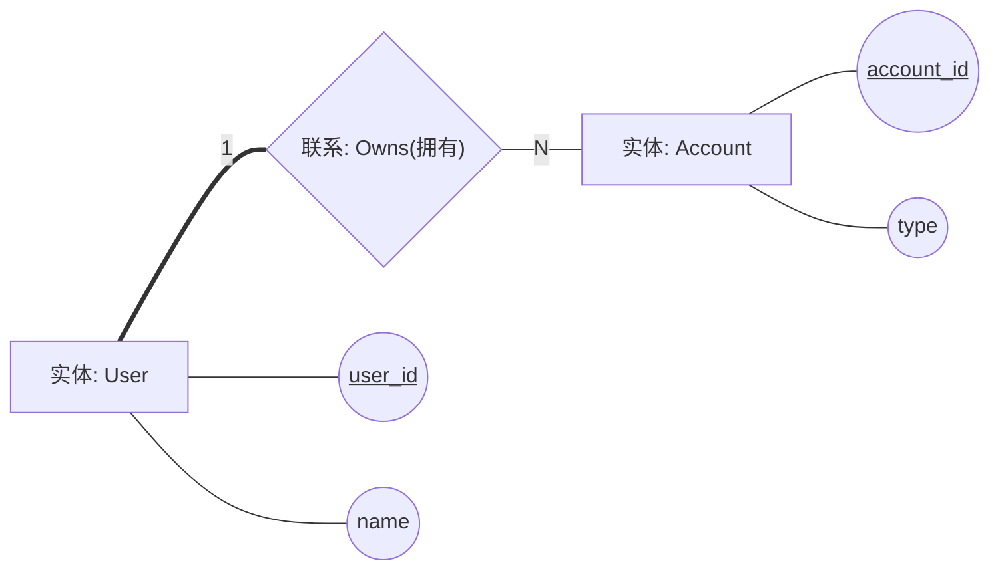

# 建模记法标准（UML + Chen E-R）

## UML 标准要求

- 所有图文件语法必须为 Mermaid（`.mmd`）。
- 采用 UML 标准语义与关系记法（建议对齐 UML 2.5.1）。
- 关系类型不得混用：关联、聚合、组合、泛化、依赖必须按标准箭头表示。
- 行为图必须体现控制流与条件，不得用文本段落替代关系线。
- 图内元素命名需与代码实体保持可追溯一致。

## E-R 图标准要求（陈氏画法）

输出 E-R 图时，必须基于真实的**数据库表设计**作为数据来源，并采用公认最标准的陈氏画法（Chen Notation）。陈氏图为概念数据模型，切忌将其画成物理模型。

### 必须画的核心元素
- **实体（Entity）**：矩形框。名称建议用单数名词（如 Student）。
- **关系（Relationship）**：菱形框。名称必须用动词或动宾短语（如“选课”、“包含”）。
- **主键属性**：椭圆 + 属性名下划线。必须画出每个实体的主键。
- **关系连线与基数**：实体 ↔ 菱形 ↔ 实体用直线连接。基数（1、N、M）必须标注在连线靠近菱形的位置（如 1:N、M:N）。

### 建议画的扩展元素（视需要）
- **重要普通属性**：椭圆。为防止图形过乱，建议每个实体只画 2-5 个核心描述性属性，**不强制画出所有属性**。
- **弱实体/弱联系**：双矩形 / 双菱形。表示依赖存在的实体（如订单与订单明细）。
- **多值属性**：双椭圆。表示可能有多个值的属性。
- **复合属性**：大椭圆分叉到小椭圆。
- **完全参与（总参与）**：实体到菱形画成双线，表示必须参与该关系。

### 绝对不画 / 应当省略的元素（工程实用红线）
- **外键字段：绝对不画**。外键是逻辑/物理实现的产物，在概念模型中通过菱形关系来表达，不得作为实体的属性椭圆出现。
- **物理表特征：绝对不画**。包括表名、字段类型（如 varchar/int）、长度、非空约束、触发器、索引等。
- **派生属性**：通常不画（如年龄、总价），保持图形简洁。
- **过多普通属性**：若表字段超过 8 个，坚决省略边缘属性，只保留核心属性。

### 语法实现
使用 Mermaid `flowchart` 表达陈氏符号语义，不得切换到其他 DSL。

### Mermaid Chen 示例

## 禁止事项

- 用 Crow's Foot / IDEF1X 代替陈氏 E-R。
- 用 UML 类图表示 E-R 并宣称为 Chen。
- 省略关键实体或联系基数，导致数据语义不完整。
- **将外键字段画成属性椭圆**（外键必须转换为菱形关系）。
- **在图中标注字段类型或长度**。
