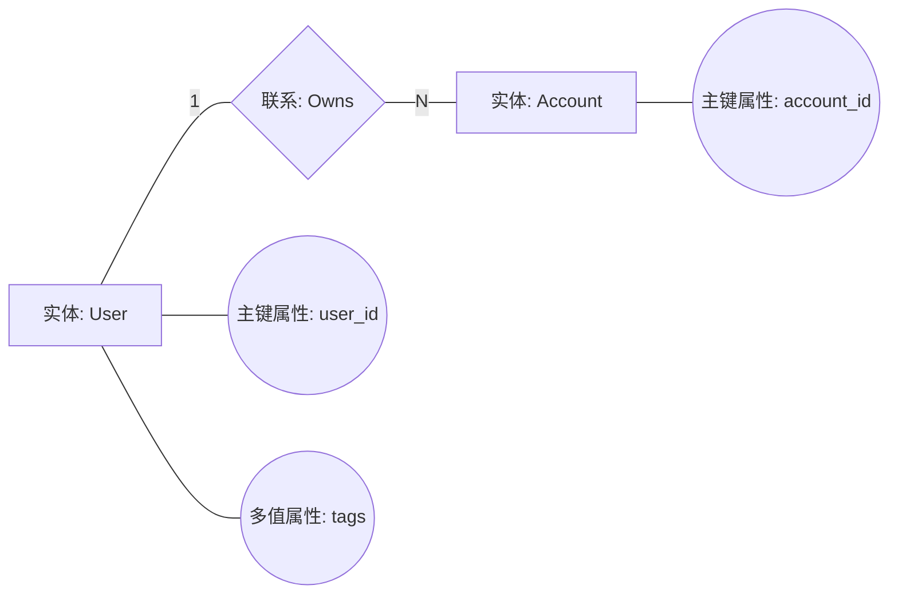

# 建模记法标准（UML + Chen E-R）

## UML 标准要求

- 所有图文件语法必须为 Mermaid（`.mmd`）。
- 采用 UML 标准语义与关系记法（建议对齐 UML 2.5.1）。
- 关系类型不得混用：关联、聚合、组合、泛化、依赖必须按标准箭头表示。
- 行为图必须体现控制流与条件，不得用文本段落替代关系线。
- 图内元素命名需与代码实体保持可追溯一致。

## E-R 图标准要求（陈氏画法）

输出 E-R 图时，必须基于真实的**数据库表设计**作为数据来源，并采用陈氏画法（Chen Notation）：

- **实体**：矩形
- **弱实体**：双矩形
- **联系**：菱形
- **弱联系**：双菱形
- **属性**：椭圆
- **主键属性**：属性名下划线
- **多值属性**：双椭圆
- **派生属性**：虚线椭圆
- **联系基数**：在连线上按 Chen 风格标注（如 1, N）
- 语法实现：使用 Mermaid `flowchart` 表达陈氏符号语义，不得切换到其他 DSL

### Mermaid Chen 示例

## 禁止事项

- 用 Crow's Foot / IDEF1X 代替陈氏 E-R。
- 用 UML 类图表示 E-R 并宣称为 Chen。
- 省略关键实体或联系基数，导致数据语义不完整。
