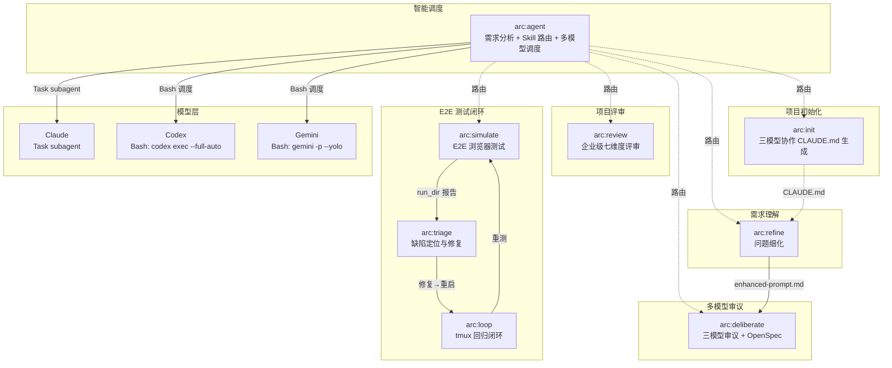
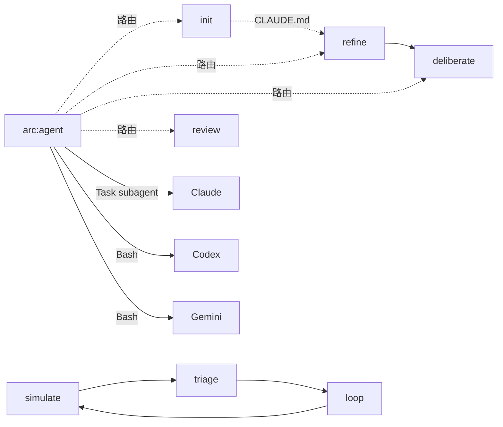

# Arc Skills

Claude Code 技能（Skill）集合，统一使用 **`arc:`** 命名空间。每个技能是一个自包含的 Skill 插件，通过 `/arc:<name>` 在 Claude Code 中调用。

## 架构总览



## 技能一览

| 调用方式 | 目录 | 用途 |
|---------|------|------|
| `/arc:agent` | `agent/` | 智能调度 agent，分析用户需求后选择合适的 arc: skill，协调三模型执行任务 |
| `/arc:simulate` | `simulate/` | 通过 agent-browser 模拟真实用户进行 E2E 浏览器测试，生成含截图的结构化报告 |
| `/arc:triage` | `triage/` | 分析 arc:simulate 的失败报告，定位根因、修复缺陷、执行回归验证 |
| `/arc:loop` | `loop/` | 管理 tmux 会话启动/重启服务，循环执行 arc:simulate 直到 PASS 或达到迭代上限 |
| `/arc:refine` | `refine/` | 扫描 CLAUDE.md 层级索引，为模糊的用户 prompt 补充项目上下文 |
| `/arc:deliberate` | `deliberate/` | 三模型（Claude/Codex/Gemini）多视角审议，使用 OpenSpec 生成结构化计划 |
| `/arc:review` | `review/` | 按企业级七维度框架深度评审软件项目，三模型对抗式分析，输出诊断报告 |
| `/arc:init` | `init/` | 三模型协作生成项目层级式 CLAUDE.md 索引体系，深度扫描后输出根级+模块级 CLAUDE.md |

## 依赖链



- `arc:agent`：统一入口，智能路由到合适的 skill 或直接调度模型
- `arc:init`：独立运行，输出的 CLAUDE.md 层级索引被 `arc:refine` 消费
- `arc:refine` → `arc:deliberate`：问题细化后进入三模型审议
- `arc:simulate` → `arc:triage` → `arc:loop` → `arc:simulate`：E2E 测试→缺陷修复→回归闭环
- `arc:review`：独立运行，不依赖其他 Skill

## 快速开始

```bash
# 在 Claude Code 中调用
/arc:agent       # 智能调度（推荐入口）
/arc:init        # 项目初始化（三模型协作生成 CLAUDE.md）
/arc:simulate    # E2E 测试
/arc:triage      # 缺陷修复
/arc:loop        # 回归闭环
/arc:refine      # 问题细化
/arc:deliberate  # 三模型审议
/arc:review      # 项目评审
```

## 技术栈

- **技能定义**：Markdown（SKILL.md frontmatter）
- **辅助脚本**：Python 3（`scripts/` 目录，`--help` 查看用法）
- **外部模型**：`codex exec` (Codex CLI) + `gemini -p` (Gemini CLI)
- **计划生成**：[OpenSpec](https://github.com/Fission-AI/OpenSpec) CLI（`openspec`）
- **代码搜索**：ace-tool MCP（语义搜索）+ Exa MCP（互联网搜索）

## 约定

详见 [CLAUDE.md](./CLAUDE.md)。
