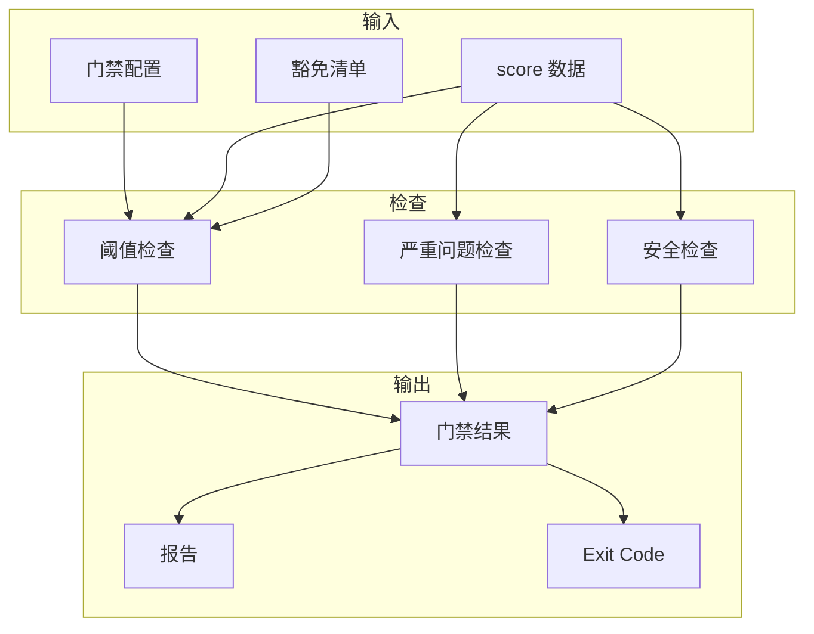

[根目录](../CLAUDE.md) > **gate**

# gate -- CI 质量门禁

## 变更记录 (Changelog)

| 时间 | 操作 |
|------|------|
| 2026-03-03 | 初始版本，创建 arc:release 子模块 |

## 模块职责

arc:release 是 CI 门禁子模块，消费 `score/` 模块产出的 score 数据执行可配置的质量门禁判定。支持多种门禁模式、阈值配置、豁免清单和 CI 集成能力。

核心能力：
- **门禁模式**：warn / strict / strict_dangerous
- **阈值配置**：总分、严重问题、安全问题
- **豁免清单**：时间有限的临时豁免
- **CI 集成**：正确的 exit code

## 入口与启动

### 入口文件

| 文件 | 用途 |
|------|------|
| `SKILL.md` | Skill 定义（权威规范） |
| `references/gate-config.yaml` | 门禁配置示例 |

### 调用方式

通过 Claude Code 调用：`arc release`

输入参数：
- `project_path` (required): 项目根目录
- `score_dir` (optional): score 产物目录
- `config` (optional): 门禁配置文件路径
- `mode` (optional): 门禁模式，默认 strict

### 工作流程

1. **Phase 1: 加载配置** — 读取门禁配置 + 评分数据
2. **Phase 2: 执行检查** — 总分/严重问题/安全阈值检查
3. **Phase 3: 豁免处理** — 检查豁免清单
4. **Phase 4: 生成报告** — 输出门禁结果

## 对外接口

### Skill 调用接口

| 参数 | 类型 | 必填 | 说明 |
|------|------|------|------|
| `project_path` | string | 是 | 项目根目录 |
| `score_dir` | string | 否 | score 产物目录 |
| `config` | string | 否 | 门禁配置文件 |
| `mode` | string | 否 | 门禁模式 |

### 输出产物

```
.arc/gate-reports/
├── gate-result.json       # 门禁结果
└── summary.md             # 执行摘要
```

### Exit Code

| Exit Code | 含义 |
|-----------|------|
| 0 | 门禁通过 |
| 1 | 门禁失败 |

## 关键依赖

| 依赖 | 类型 | 用途 |
|------|------|------|
| score 内置阶段 | 必须 | 提供量化评分数据 |
| Python 3.10+ | 必须 | 脚本执行环境 |

## 数据模型

### 门禁结果模型

```json
{
  "status": "pass|fail",
  "mode": "warn|strict|strict_dangerous",
  "overall_score": 75,
  "violations": [...],
  "whitelist_applied": 2,
  "exit_code": 0
}
```

### 豁免项模型

```yaml
- id: string              # 豁免唯一标识
  rule: string            # 规则 ID
  file: string            # 文件路径
  reason: string          # 豁免原因
  approved_by: string     # 审批人
  expires_at: ISO8601     # 过期时间
```

## 架构图



## 关联文件清单

| 文件 | 职责 |
|------|------|
| `SKILL.md` | Skill 定义（权威规范） |
| `scripts/check_gate.py` | 门禁检查脚本 |
| `references/gate-config.yaml` | 门禁配置示例 |

## 注意事项

1. **配置优先级**：
   - 命令行参数 > 项目配置 > 默认配置

2. **豁免过期**：
   - 过期的豁免项自动失效
   - 在报告中标注过期豁免

3. **CI 集成**：
   - 必须使用 `--exit-code` 参数
   - 建议配置 artifact 上传报告
