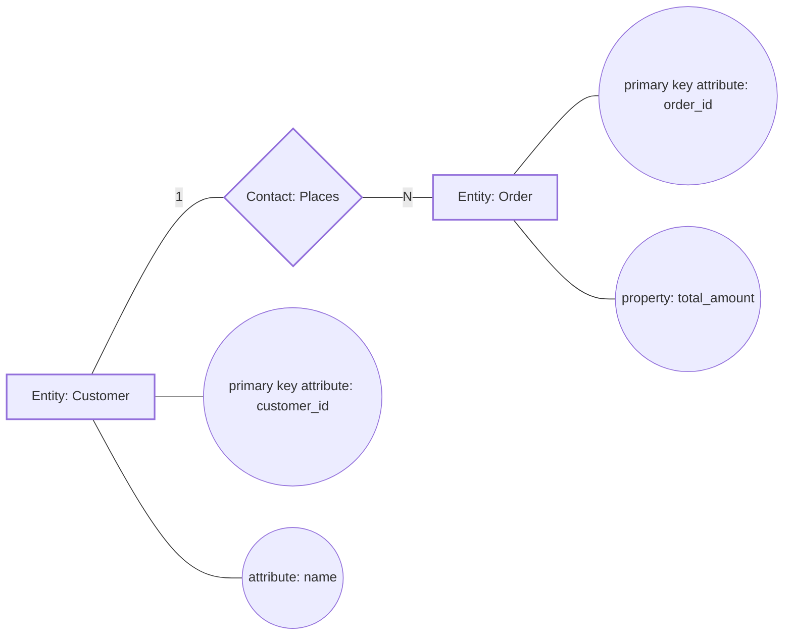

# arc:uml — Project UML diagram generation

## Overview

`arc:uml` is used to generate UML diagrams from real project evidence (code, configurations, interfaces, deployments and business processes).
This skill emphasizes "selecting graphics according to actual conditions", rather than mechanically drawing all 14 types of graphics.
All UML diagrams must conform to UML standard notation (it is recommended to align with UML 2.5.1); if the project requires E-R diagrams, **Chen's notation** must be used.

## Quick Contract

- **Trigger**: A traceable system modeling diagram needs to be established to assist communication, review, handover or architecture evolution.
- **Inputs**: project path, attention graph, business scenario, deployment environment, output format.
- **Outputs**: Diagram applicability matrix, UML diagram file (fixed Mermaid `.mmd`), diagram directory and evidence mapping; additionally output Chen's E-R diagram if applicable.
- **Quality Gate**: Must pass `## Quality Gates`'s evidence consistency and inter-figure consistency check before delivery.
- **Decision Tree**: For the input signal routing diagram, see [`docs/arc-routing-matrix.md`](../docs/arc-routing-matrix.md#signal-to-skill-decision-tree).

## Routing Matrix

- For unified routing comparison, see [`docs/arc-routing-matrix.md`](../docs/arc-routing-matrix.md).
- A phased getting started view is available at [`docs/arc-routing-matrix.md`](../docs/arc-routing-matrix.md#phase-routing-view).
- For a quick cheat sheet, see [`docs/arc-routing-cheatsheet.md`](../docs/arc-routing-cheatsheet.md).
- If there is a conflict, the **Boundary Note** of this skill `## When to Use` shall prevail.

## Announce

Begin by stating clearly:
"I'm using `arc:uml` to make a pattern applicability determination and then output an evidence-based UML diagram."

## Teaming Requirement

- Every execution must first "draw a team together" and at least clarify the three roles and responsibilities of `Owner`, `Executor` and `Reviewer`.
- If the operating environment only has a single Agent, the three-role perspective must be explicitly output during delivery to form a "decision-execution-review" closed loop before submitting the conclusion.

## The Iron Law

```
NO DIAGRAM WITHOUT EVIDENCE, NO RELATION WITHOUT TRACEABILITY
NO ER DIAGRAM WITHOUT CHEN NOTATION
```

Don't draw pictures without evidence, don't connect lines without traceable relationships.

## Workflow

1. Scan project context (code structure, configuration, API, business processes, deployment information).
2. Output 14 graphical applicability matrix (output/suspended/not applicable + justification + evidence).
3. Generate UML files and index directories for applicable diagrams (add Chen's E-R diagram when data modeling is required).
4. Perform consistency check between graphs and output delivery instructions.

## Quality Gates

- Each diagram must provide corresponding evidence (`file:line`, configuration path or interface definition).
- "Not applicable" graphics must give a clear reason and cannot be left blank.
- The naming of core entities must be consistent between different diagrams (module name, service name, domain object name).
- The relationships between deployment, component, and configuration diagrams must be mappable to each other.
- The semantics and notation of UML diagrams must conform to standards (relationship types, visibility, and life cycle semantics cannot be mixed).
- If you want to output an E-R diagram, you must use Chen's drawing method (entity rectangle, contact rhombus, attribute ellipse, multi-valued double ellipse, weak entity double rectangle).

## Expert Standards

- UML output needs to be aligned to `UML 2.5.1 / ISO 19505` Semantics, relationships and visibility are not allowed to be mixed.
- Behavioral class diagrams (sequences/activities/states) must be named consistently with static class diagram entities and can be mutually verified.
- Architectural class diagrams (components/deployments/packages) need to align with runtime environment evidence (configuration, topology, interface boundaries).
- If E-R is output, the `Chen` notation must be strictly used (complete expression of entity/relationship/attribute semantics).
- Each picture is accompanied by `Modeling Assumptions + Evidence Location + Applicable Boundaries` to avoid beautiful pictures but unfeasible results.

## Scripts & Commands

- Generate UML skeleton (by diagram): `python3 arc:uml/scripts/scaffold_uml_pack.py --output-dir <uml_dir> --types class,sequence,deployment`
- Generate full UML skeleton: `python3 arc:uml/scripts/scaffold_uml_pack.py --output-dir <uml_dir> --types all`
- Generate Chen's E-R skeleton at the same time: `python3 arc:uml/scripts/scaffold_uml_pack.py --output-dir <uml_dir> --types all --include-er-chen`
- Runtime main command: `arc uml`

## Red Flags

- Just apply the template and draw the picture without looking at the project evidence.
- 14 All graphics are produced forcibly, ignoring the actual scale and stage of the project.
- E-R diagrams use crow's feet or diagram-like symbols to pass off Chen's drawing method.
- There are only pictures without text description, so the basis of modeling cannot be explained.
- The naming of the diagram and the code are seriously inconsistent and cannot be used for handover.

## Context Budget (avoid Request too large)

- Only key directories, key configurations, and key processes are extracted, and the entire warehouse code is not pasted.
- The evidence fragments of each picture are controlled to 5-20 lines of key fragments.
- Complex systems are output in separate domains to avoid overloading a single image.

## When to Use

- **Primary Trigger**: Systematic UML diagrams are required to illustrate architecture, interactions, deployment, or business processes.
- **Typical Scenario**: new member onboarding, architecture review, technical due diligence, pre-release knowledge accumulation, and cross-team alignment.
- **Boundary Note**: Only the warehouse structure needs to use `arc:cartography` first; only quality diagnosis needs to use `arc:audit` first.

## Input Arguments

| parameter | type | Required | illustrate |
|------|------|------|------|
| `project_path` | string | yes | Absolute path to project root directory |
| `project_name` | string | no | Project ID; deduced from path by default |
| `diagram_types` | array | no | Specify a list of graphics; automatically selected by suitability by default |
| `business_scenarios` | array | no | Key business scenarios (for use case/activity/sequence modeling) |
| `deployment_targets` | array | no | Deployment target (such as k8s/ecs/vm/on-prem) |
| `render_format` | string | no | Fixed to `mermaid` (mandatory) |
| `include_er` | boolean | no | Whether to output the E-R diagram (it must be Chen's drawing method when outputting), automatically determined by default |
| `depth_level` | string | no | `quick` / `standard` / `deep`, default `standard` |
| `output_dir` | string | no | Default `<project_path>/.arc/arc:uml/` |

## Diagram Catalog (14 categories)

1. Class diagram (class)
2. object graph
3. component diagram
4. Deployment diagram (deployment)
5. package
6. Composite structure diagram (composite-structure)
7. Configuration file diagram (configuration, extended view)
8. Use case diagram (use-case)
9. Activity diagram (activity)
10. State machine diagram (state-machine)
11. sequence diagram
12. communication diagram
13. Interaction overview diagram (interaction-overview)
14. Timing

> See the evidence mapping and applicable conditions of `references/diagram-catalog.md` for details.

## Notation Standards

- UML diagrams: follow UML standard semantics and are expressed using Mermaid syntax (recommended semantic baseline UML 2.5.1).
- E-R diagram: Use Mermaid syntax to express Chen's drawing method; use of Crow's Foot / IDEF1X instead is prohibited.
- See `references/notation-standards.md` for the determination details.

### Mermaid Chen E-R Example



## Dependencies

* **Organization Contract**: Required. Follows `docs/orchestration-contract.md`, executed through the runtime adaptation layer.
* **ace-tool (MCP)**: Required. Used to scan code structure, module dependencies, interfaces and implementation evidence.
* **Exa MCP**: Optional. Used to supplement UML modeling conventions or framework conventions.
* **Mermaid**: Required. All plots must be output using Mermaid syntax.
* **Auxiliary script**: `scripts/scaffold_uml_pack.py`, used to initialize the graph file skeleton.

## Instructions (execution process)

### Phase 1: Project Modeling Reconnaissance

1. Scan project modules, entities, interfaces, configurations, deployments and business process evidence.
2. Generate `context/project-snapshot.md` with an initial evidence list.

### Phase 2: Determination of graphic applicability

1. Determine the 14 patterns one by one: `required` / `recommended` / `not-applicable`.
2. Determine whether an E-R diagram is required (data modeling scenarios typically `required`).
3. The output `diagram-plan.md` includes graphics, judgment results, reasons, and evidence sources.

### Phase 3: Map output

1. Run the script to initialize the skeleton (optional):
   ```bash
   python3 scripts/scaffold_uml_pack.py --output-dir <output_dir> --types all
   ```
2. If an E-R diagram is required, initialize Chen's E-R skeleton:
   ```bash
   python3 scripts/scaffold_uml_pack.py --output-dir <output_dir> --types all --include-er-chen
   ```
3. Write complete relationships and comments to the `required` and `recommended` graphics.
4. Generate `diagram-index.md` as the delivery directory.

### Phase 4: Consistency Verification

1. Check entity naming consistency (class, component, service, node).
2. Check for cross-graph consistency (component diagram ↔ deployment diagram ↔ configuration diagram).
3. If there is an E-R diagram, check whether it is strict with Chen's drawing method.
4. Output `validation-summary.md` with subsequent maintenance recommendations.

## Outputs

```text
<project_path>/.arc/arc:uml/<project-name>/
├── context/
│   └── project-snapshot.md
├── diagram-plan.md
├── diagram-index.md
├── validation-summary.md
└── diagrams/
    ├── class.mmd
    ├── object.mmd
    ├── component.mmd
    ├── deployment.mmd
    ├── package.mmd
    ├── composite-structure.mmd
    ├── configuration.mmd
    ├── use-case.mmd
    ├── activity.mmd
    ├── state-machine.mmd
    ├── sequence.mmd
    ├── communication.mmd
    ├── interaction-overview.mmd
    ├── timing.mmd
└── er-chen.mmd # Optional: Chen's E-R diagram
```

## Anti-Patterns

- Draw "good-looking pictures" but don't connect them to the real code and configuration.
- Treat the configuration file diagram as a pure screenshot and do not express the relationship between configurations.
- In the sequence diagram, only the happy path is written, and exceptions and timeout branches are ignored.
- The E-R diagram does not use Chen's drawing symbols or the base expression is irregular.
- The output map has no maintenance strategy, causing it to expire quickly.
