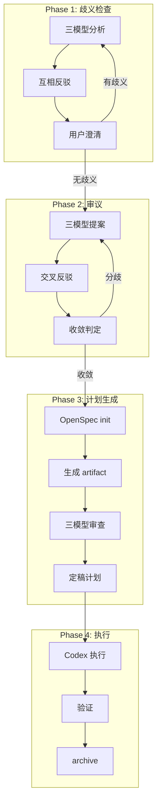

[根目录](../CLAUDE.md) > **deliberate**

# deliberate -- 三模型审议与计划生成

## 变更记录 (Changelog)

| 时间 | 操作 |
|------|------|
| 2026-02-24T16:30:00 | arc:init 三模型协作生成模块级 CLAUDE.md |

## 模块职责

arc:deliberate 通过共享文件系统协调 Claude、Codex、Gemini 三个模型进行迭代式协作审议，使用 OpenSpec 生成结构化可执行计划。适用于复杂技术决策、架构设计、方案对比等需要多视角验证的场景。

核心能力：
- **歧义检查**：三模型分析需求 → 识别歧义 → 用户澄清 → 直到无歧义
- **迭代审议**：三模型独立提案 → 交叉审阅 → 互相反驳 → 迭代收敛
- **OpenSpec 集成**：生成 proposal → specs → design → tasks 结构化计划
- **证据驱动**：使用 ace-tool MCP 和 Exa MCP 搜索项目上下文和最佳实践

## 入口与启动

### 入口文件

| 文件 | 用途 |
|------|------|
| `SKILL.md` | Skill 定义（权威规范），含完整的四阶段流程 |

### 调用方式

通过 Claude Code 调用：`/arc:deliberate`

输入参数：
- `task_name` (required): 任务名称，用于目录命名
- `workdir` (required): 工作目录绝对路径
- `enhanced_prompt_path` (optional): 增强 prompt 路径
- `max_rounds` (optional): 最大审议迭代轮次，默认 3
- `max_ambiguity_rounds` (optional): 最大歧义检查轮次，默认 3

### 工作流程

**Phase 1: 歧义检查**
1. 三模型并发分析需求，识别歧义
2. 互相反驳歧义分析
3. 聚合歧义，用户澄清
4. 重复直到无歧义或达到上限

**Phase 2: 审议阶段**
1. 三模型并发提案
2. 交叉审阅 + 互相反驳
3. 收敛判定 → 共识报告

**Phase 3: 计划生成（OpenSpec）**
1. `openspec init --tools none`
2. `openspec new change <task-name>`
3. 按序生成 proposal → specs → design → tasks
4. 三模型审查反驳
5. 定稿计划

**Phase 4: 执行阶段**
1. Codex 按 tasks.md 执行代码实现
2. 验证产出
3. `openspec archive`

## 对外接口

### Skill 调用接口

| 参数 | 类型 | 必填 | 说明 |
|------|------|------|------|
| `task_name` | string | 是 | 任务名称 |
| `workdir` | string | 是 | 工作目录 |
| `enhanced_prompt_path` | string | 否 | 增强 prompt 路径 |
| `max_rounds` | number | 否 | 最大审议轮次 |
| `max_ambiguity_rounds` | number | 否 | 最大歧义检查轮次 |

### 输出产物

```
<workdir>/.arc/deliberate/<task-name>/
├── context/
│   └── enhanced-prompt.md              # arc:refine 产出
├── claude/
│   ├── ambiguity-round-N.md            # 歧义分析
│   ├── proposal-round-N.md             # 提案
│   ├── critique-round-N.md             # 审阅反驳
│   └── plan-review.md                  # 计划审查
├── codex/
│   └── ...                             # 同 claude 结构
├── gemini/
│   └── ...                             # 同 claude 结构
├── convergence/
│   └── round-N-summary.md              # 收敛判定摘要
│   └── final-consensus.md              # 最终共识
└── openspec/
    └── changes/<task-name>/
        ├── proposal.md                 # 方案提案
        ├── specs/                      # 详细规范
        ├── design.md                   # 架构设计
        └── tasks.md                    # 有序可执行任务
```

## 关键依赖

| 依赖 | 类型 | 用途 |
|------|------|------|
| ace-tool MCP | 必须 | 搜索项目代码结构 |
| Exa MCP | 推荐 | 搜索最佳实践和技术文档 |
| codex CLI | 必须 | Codex 模型执行 |
| gemini CLI | 必须 | Gemini 模型执行 |
| openspec CLI | 必须 | 结构化计划生成 |

## 数据模型

### 共识报告模型

```markdown
# 共识报告: <任务名>

## 问题背景
<原始问题描述>

## 解决方案概述
<一句话方案摘要>

## 方案详述
<各方观点的综合>

## 风险与缓解
<识别到的风险及应对>

## 未解决分歧（如有）
<未达成的问题及原因>

## 结论
<最终建议>
```

### OpenSpec tasks.md 格式

```markdown
## 1. <任务分组名>

- [ ] 1.1 <任务描述> [~2min]
- [ ] 1.2 <任务描述> [~5min]

## 2. <任务分组名>

- [ ] 2.1 <任务描述> [~3min]
```

### AI 耗时标注基准

| 复杂度 | 预估耗时 | 示例 |
|--------|---------|------|
| 简单 | ~1-2min | 单文件修改、配置调整 |
| 中等 | ~3-5min | 新增模块/接口、跨 2-3 文件 |
| 高 | ~5-15min | 架构变更、跨模块重构 |
| 超大 | ~15-30min | 新增微服务、全面重构 |

## 架构图



## 测试与质量

### 质量约束

1. **必须互相反驳**：三模型必须挑战对方观点
2. **MCP 优先**：分析前必须先使用 MCP 搜索信息
3. **OpenSpec 验证**：生成后必须运行 `openspec validate`

### 超时与降级

| 情况 | 处理 |
|------|------|
| 单模型超时 > 10min | 询问用户是否继续用剩余模型 |
| 达到 max_ambiguity_rounds | 标记未解决歧义，进入审议 |
| 达到 max_rounds 未收敛 | 强制合成共识，标注分歧 |
| openspec 命令失败 | 手动编写 tasks.md |

### 覆盖率

- 无自动化单元测试
- 质量保障依赖三模型对抗机制

## 关联文件清单

| 文件 | 职责 |
|------|------|
| `SKILL.md` | Skill 定义（权威规范），含完整的四阶段流程 |

## 注意事项

1. **模型调用方式**：
   - Claude: `Task({ subagent_type: "general-purpose", run_in_background: true })`
   - Codex: `codex exec -C "<workdir>" --full-auto`
   - Gemini: `gemini -p "<prompt>" --yolo`

2. **并发执行**：
   - 三模型必须在同一消息中并发发起
   - 使用 `run_in_background: true`

3. **OpenSpec 工作流**：
   - 必须按 `proposal → specs → design → tasks` 顺序生成
   - 每个 artifact 生成后检查依赖完整性

4. **工作目录**：
   - 所有产出写入 `<workdir>/.arc/deliberate/<task-name>/`
   - OpenSpec 工作空间在此目录内初始化

5. **AI 耗时标注**：
   - tasks.md 中每个任务必须标注 AI 执行预估耗时
   - 使用 `[~Xmin]` 格式
