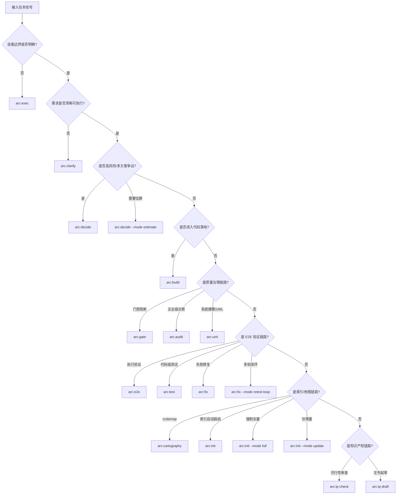

# ARC Skill Routing Matrix

统一 `arc:*` 技能路由参考，优先用于“该用谁 / 不该用谁”的快速判定。  
若与单个 Skill 细则冲突，以该 Skill 的 `## When to Use`（尤其是**边界提示**）为准。

| Skill | 首选触发 | 不建议使用时机 | 推荐下游 / 邻接技能 |
|---|---|---|---|
| `arc:exec` | 需求模糊或跨技能编排 | 已明确具体技能且边界清晰 | `arc:clarify` / `arc:decide` / `arc:build` |
| `arc:clarify` | 需求不清、上下文缺失 | 方案已清晰可直接执行 | `arc:decide` / `arc:build` |
| `arc:decide` | 高风险决策需多视角论证 | 仅需单路径快速执行 | `arc:build` / `arc:audit` |
| `arc:build` | 方案已定，开始代码落地 | 需求与边界尚未澄清 | `arc:audit` / `arc:e2e` |
| `arc:audit` | 企业级多维诊断与路线图 | 仅需门禁阻断判定 | `arc:gate` / `arc:build` |
| `arc:gate` | 合并/上线门禁判定（Go/No-Go） | 尚未生成可用评分产物 | `score 产物刷新（由 gate 编排）` |
| `arc:e2e` | 真实用户路径 E2E 验证 | 没有测试入口或账号上下文 | `arc:fix` |
| `arc:test` | 代码级测试生成（单测/边界/benchmark/fuzz） | 浏览器 E2E 验证或修复已有失败测试 | `arc:e2e` / `arc:fix` |
| `arc:fix` | 基于 FAIL 工件做定位修复 | 尚无可复现失败证据 | `arc:e2e`（先产证据） / `arc:fix --mode retest-loop` |
| `arc:cartography` | 需生成或刷新 `codemap` | 仅做需求澄清或编码落地 | `arc:clarify` / `arc:build` / `arc:audit` |
| `arc:uml` | 需要按项目实际情况输出 UML 图谱 | 仅需仓库目录概览或单点评审结论 | `arc:cartography` / `arc:audit` / `arc:build` |
| `arc:init` | 自动选择 full/update 维护索引 | 与索引无关的普通开发任务 | `arc:init --mode full` / `arc:init --mode update` |
| `arc:ip-check` | 申请前 IP 可行性与风险评估 | 已进入正式文书撰写阶段 | `arc:ip-draft` |
| `arc:ip-draft` | 基于审查交接起草申请材料 | 尚未完成可行性审查 | `arc:ip-check` |

## Signal-to-Skill Decision Tree

## Phase Routing View

| 阶段 | 目标 | 主技能（Primary） | 辅助技能（Support） | 典型交接 |
|---|---|---|---|---|
| 澄清（Clarify） | 从模糊输入转为可执行需求 | `arc:exec` / `arc:clarify` | `arc:cartography` | `refined prompt` → 决策/落地 |
| 决策（Decide） | 处理高风险方案分歧 | `arc:decide` | `arc:decide --mode estimate` | `consensus plan` → 实施 |
| 落地（Build） | 产出可提交代码变更 | `arc:build` | `arc:init` / `arc:cartography` | `change handoff` → 验证 |
| 建模（Modeling） | 输出结构/行为/部署 UML 图谱 | `arc:uml` | `arc:cartography` / `arc:audit` | `uml pack` → 评审/交接 |
| 验证（Validate） | 验证行为、定位失败、闭环修复 | `arc:e2e` / `arc:test` / `arc:fix` | `arc:fix --mode retest-loop` / `arc:build` | `pass/fail evidence` → 治理 |
| 治理（Govern） | 门禁阻断、改进路线与治理闭环 | `arc:gate` / `arc:audit` | `arc:build` | `arc:gate/review outputs` |
| 知识产权（IP） | 先审查可行性，再起草材料 | `arc:ip-check` / `arc:ip-draft` | `arc:audit` | `ip-drafting-input` → 申请材料草稿 |

## Fast Routing Rules

- 先判定“是否已明确技能边界”：不明确优先 `arc:exec`。
- 先判定“是否已明确需求边界”：未明确优先 `arc:clarify`。
- 先判定“是否争议高风险”：高风险优先 `arc:decide`。
- 先判定“是否进入落地阶段”：已明确直接 `arc:build`。
- 先判定“是否需要系统建模图”：需要 UML 图谱优先 `arc:uml`。
- 质量链路默认：`arc:gate`（先触发 `score/`），必要时并联 `arc:audit`。
- E2E 修复链路默认：`arc:e2e` → `arc:fix`（循环则 `arc:fix --mode retest-loop`）。
