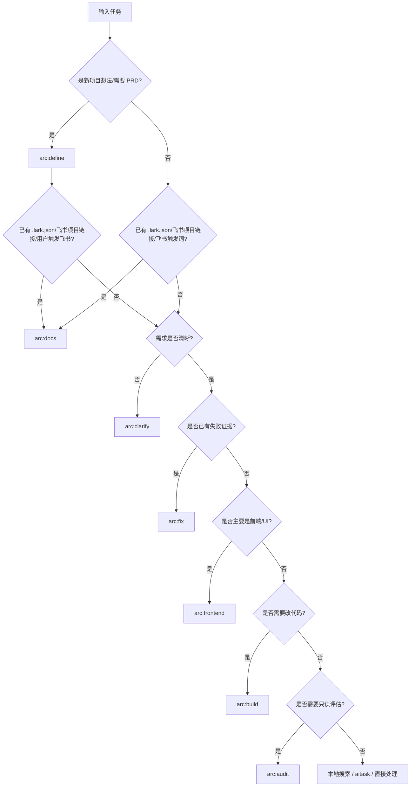

# Arc Lifecycle Routing Matrix

Arc 收敛为七个 `arc:*` 软件工程生命周期 Skill。若任务涉及代码库搜索或上下文定位，优先使用 `.ai-code-index/` 本地搜索脚本；若项目根目录已有 `.lark.json`，优先从索引找项目主页、项目文件空间、PRD、需求、架构、进度、资料和交付记录；若没有 `.lark.json`，只有在用户明确要求创建/连接飞书项目空间或提供飞书项目链接时才创建飞书资源；若任务涉及编排、Inbox 或跨 Agent 协作，优先使用 `aitask`。

| Skill | 首选触发 | 不建议使用时机 | 常见后续 |
|---|---|---|---|
| `arc:define` | 项目想法待结构化、需要 PRD/Blueprint | 任务级澄清或已有清晰项目定义 | `arc:docs` / `arc:clarify` |
| `arc:clarify` | 需求不清、上下文缺失、验收标准缺失 | 需求已明确可直接执行 | `arc:docs` / `arc:build` |
| `arc:docs` | 已有 `.lark.json`、用户给飞书项目链接、或明确要求创建/连接/同步飞书项目空间 | 只做本地代码实现且用户未触发飞书 | `arc:define` / `arc:build` / `arc:audit` |
| `arc:build` | 方案明确，需要代码交付和验证 | 根因未知的失败修复 | `arc:docs` / `arc:audit` |
| `arc:frontend` | 需要前端基线、UI 实现、主题或前端进度沉淀 | 纯后端/API/无前端工作 | `arc:build` / `arc:docs` |
| `arc:fix` | 有失败证据、线上故障、测试失败 | 只是新功能开发 | `arc:docs` / `arc:audit` |
| `arc:audit` | 需要只读体检、风险盘点、改进建议 | 需要直接改代码 | `arc:clarify` / `arc:build` / `arc:docs` |

## Decision Tree

## Fast Rules

- 需要多人/多 Agent/跨会话/记忆：用 `aitask`，不要用 Arc。
- 需要代码库搜索或上下文定位：用 `.ai-code-index/search.sh`、`struct-search.sh`、`symbols.sh`，不要在 Arc 内另建搜索机制。
- 已存在 `.lark.json` 时，所有 Arc 生命周期工作都应先读取它；有交付、修复、审计或文档变更时追加 lifecycle 记录。
- 没有 `.lark.json` 时，普通代码/修复/审查/资料搜索任务不询问、不创建飞书；只有用户明确说创建/连接飞书项目空间或提供飞书项目链接后才用 `arc:docs`。
- 创建/连接项目空间后，必须把项目文件空间飞书地址写入 `.lark.json.resources.drive_folder.url`；下一次启动 AI 或进入项目时先读取 `.lark.json`。
- 后续搜索到的资料、新增文档、外部链接、接口说明、架构事实、决策、截图、报告、会议纪要和交付证据，属于已有 `.lark.json` 的项目时都要通过 `arc:docs` 写入飞书对应资源并追加 lifecycle 来源。
- `创建项目的飞书空间`、`创建飞书项目空间`、`创建完整飞书项目空间`、`一键创建飞书项目空间`、`create Lark project space` 表示 full workspace：一次性创建标准项目文件夹、文档、多维表格、仪表盘、项目流、日历、协作、画板、自动化等飞书资源，并全部写入 `.lark.json`。
- `更新飞书项目空间`、`刷新飞书项目空间`、`补齐飞书项目空间`、`同步飞书项目空间`、`refresh Lark project space` 表示 workspace update：校验既有 `.lark.json` 或飞书链接，修复断链/缺失索引，补齐标准资源，刷新任务表、仪表盘、项目流和自动化，不重复创建空间。
- 其它飞书触发词只创建用户点名的资源；不得顺手创建完整项目空间。
- 需要浏览器自动化：用 `agent-browser` 或相关浏览器工具。
- 需要图表：用 `drawio`。
- 需要测试：直接按项目测试框架生成或运行，不再走 Arc 内部测试 Skill。
- 需要 E2E：直接使用项目 E2E 工具或 `agent-browser`，不再走 Arc 内部 E2E Skill。
- 防范 AI 代码腐化：每个 Arc 技能在 `## Code Rot Gates` 引用 [`code-rot-taxonomy.md`](code-rot-taxonomy.md) 中各自负责的家族切片；define→命名，clarify→减枝/状态，docs→资料追踪，build→实施期门禁，frontend→前端一致性，fix→数据层/状态根因，audit→全 36 条复查。
