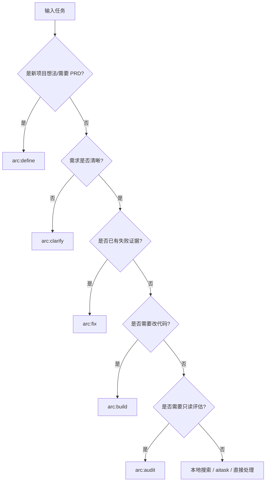

# Lean Arc Routing Matrix

Arc 收敛为五个轻量 Skill：一个项目级（define），四个任务级（clarify/build/fix/audit）。若任务涉及代码库搜索或上下文定位，优先使用 `.ai-code-index/` 本地搜索脚本；若任务涉及编排、Inbox、项目状态同步或跨 Agent 协作，优先使用 `aitask`。

| Skill | 首选触发 | 不建议使用时机 | 常见后续 |
|---|---|---|---|
| `arc:define` | 项目想法待结构化、需要 PRD/Blueprint | 任务级澄清或已有清晰项目定义 | `arc:clarify` / `arc:build` |
| `arc:clarify` | 需求不清、上下文缺失、验收标准缺失 | 需求已明确可直接执行 | `arc:build` / `arc:audit` |
| `arc:build` | 方案明确，需要代码交付和验证 | 根因未知的失败修复 | `arc:audit` |
| `arc:fix` | 有失败证据、线上故障、测试失败 | 只是新功能开发 | `arc:build` / `arc:audit` |
| `arc:audit` | 需要只读体检、风险盘点、改进建议 | 需要直接改代码 | `arc:clarify` / `arc:build` |

## Decision Tree

## Fast Rules

- 需要多人/多 Agent/跨会话/记忆：用 `aitask`，不要用 Arc。
- 需要代码库搜索或上下文定位：用 `.ai-code-index/search.sh`、`struct-search.sh`、`symbols.sh`，不要在 Arc 内另建搜索机制。
- 需要浏览器自动化：用 `agent-browser` 或相关浏览器工具。
- 需要图表：用 `drawio`。
- 需要测试：直接按项目测试框架生成或运行，不再走 Arc 内部测试 Skill。
- 需要 E2E：直接使用项目 E2E 工具或 `agent-browser`，不再走 Arc 内部 E2E Skill。
- 防范 AI 代码腐化：每个 Arc 技能在 `## Code Rot Gates` 引用 [`code-rot-taxonomy.md`](code-rot-taxonomy.md) 中各自负责的家族切片；define→命名，clarify→减枝/状态，build→实施期门禁，fix→数据层/状态根因，audit→全 36 条复查。
