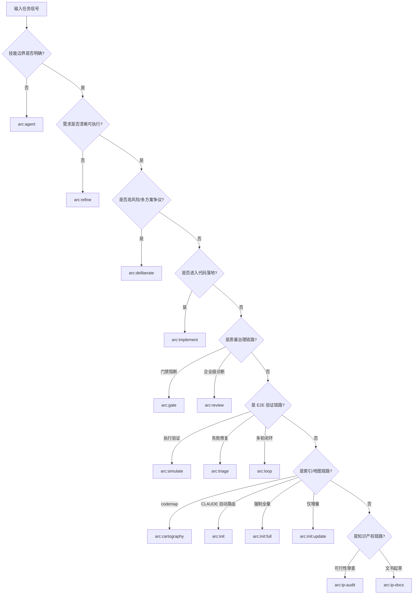

# ARC Skill Routing Matrix

统一 `arc:*` 技能路由参考，优先用于“该用谁 / 不该用谁”的快速判定。  
若与单个 Skill 细则冲突，以该 Skill 的 `## When to Use`（尤其是**边界提示**）为准。

| Skill | 首选触发 | 不建议使用时机 | 推荐下游 / 邻接技能 |
|---|---|---|---|
| `arc:agent` | 需求模糊或跨技能编排 | 已明确具体技能且边界清晰 | `arc:refine` / `arc:deliberate` / `arc:implement` |
| `arc:refine` | 需求不清、上下文缺失 | 方案已清晰可直接执行 | `arc:deliberate` / `arc:estimate` / `arc:implement` |
| `arc:deliberate` | 高风险决策需多视角论证 | 仅需单路径快速执行 | `arc:implement` / `arc:review` |
| `arc:estimate` | 需要工时区间与波次排期 | 问题仍未定 scope | `arc:implement` / 项目管理流程 |
| `arc:implement` | 方案已定，开始代码落地 | 需求与边界尚未澄清 | `arc:review` / `arc:simulate` |
| `arc:review` | 企业级多维诊断与路线图 | 仅需门禁阻断判定 | `arc:gate` / `arc:implement` |
| `arc:gate` | CI/CD 质量门禁阻断 | 尚未生成可用评分产物 | `score 产物刷新（gate 内部）` |
| `arc:simulate` | 真实用户路径 E2E 验证 | 没有测试入口或账号上下文 | `arc:triage` / `arc:loop` |
| `arc:triage` | 基于 FAIL 工件做定位修复 | 尚无可复现失败证据 | `arc:simulate`（先产证据） |
| `arc:loop` | 需重启服务的多轮回归闭环 | 一次性单轮排查即可完成 | `arc:simulate` / `arc:triage` |
| `arc:cartography` | 需生成或刷新 `codemap` | 仅做需求澄清或编码落地 | `arc:refine` / `arc:implement` / `arc:review` |
| `arc:init` | 自动选择 full/update 维护 CLAUDE 索引 | 已明确必须 full 或 update | `arc:init:full` / `arc:init:update` |
| `arc:init:full` | 首次初始化或全量重建 | 仅有局部增量变更 | `arc:init:update`（后续维护） |
| `arc:init:update` | 已有基线的增量同步 | 缺失基线或基线严重失效 | `arc:init` / `arc:init:full` |
| `arc:ip-audit` | 申请前 IP 可行性与风险评估 | 已进入正式文书撰写阶段 | `arc:ip-docs` |
| `arc:ip-docs` | 基于审查交接起草申请材料 | 尚未完成可行性审查 | `arc:ip-audit` |

## Signal-to-Skill Decision Tree

## Phase Routing View

| 阶段 | 目标 | 主技能（Primary） | 辅助技能（Support） | 典型交接 |
|---|---|---|---|---|
| 澄清（Clarify） | 从模糊输入转为可执行需求 | `arc:agent` / `arc:refine` | `arc:cartography` | `refined prompt` → 决策/落地 |
| 决策（Decide） | 处理高风险方案分歧 | `arc:deliberate` | `arc:estimate` | `consensus plan` → 实施 |
| 落地（Build） | 产出可提交代码变更 | `arc:implement` | `arc:init*` / `arc:cartography` | `change handoff` → 验证 |
| 验证（Validate） | 验证行为、定位失败、闭环修复 | `arc:simulate` / `arc:triage` / `arc:loop` | `arc:implement` | `pass/fail evidence` → 治理 |
| 治理（Govern） | 门禁阻断、改进路线与治理闭环 | `arc:gate` / `arc:review` | `arc:implement` | `gate/review outputs` |
| 知识产权（IP） | 先审查可行性，再起草材料 | `arc:ip-audit` / `arc:ip-docs` | `arc:review` | `ip-drafting-input` → 申请材料草稿 |

## Fast Routing Rules

- 先判定“是否已明确技能边界”：不明确优先 `arc:agent`。
- 先判定“是否已明确需求边界”：未明确优先 `arc:refine`。
- 先判定“是否争议高风险”：高风险优先 `arc:deliberate`。
- 先判定“是否进入落地阶段”：已明确直接 `arc:implement`。
- 质量链路默认：`arc:gate`，必要时并联 `arc:review`。
- E2E 修复链路默认：`arc:simulate` → `arc:triage`（循环则 `arc:loop`）。
