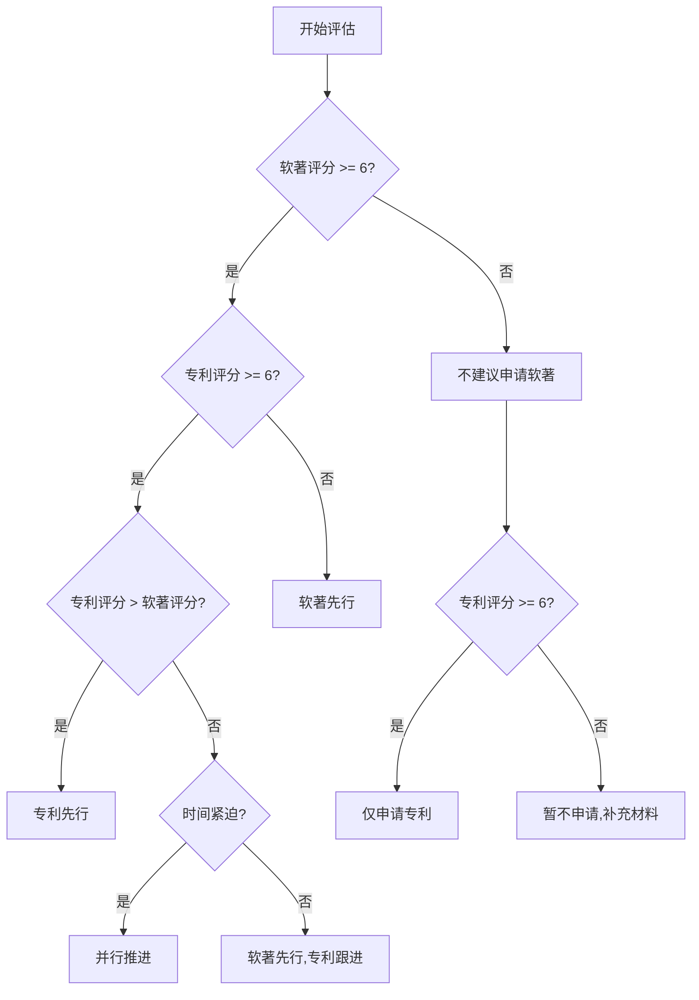

# 知识产权可行性评估框架

本文档定义 `arc:ip-audit` 使用的可行性评估维度、评分标准与风险矩阵。

## 评估维度体系

### 软件著作权可行性评估

#### 1. 代码完整性 (Code Completeness)

**评分标准 (1-10分)**:

| 分数 | 标准 | 证据要求 |
|------|------|---------|
| 9-10 | 核心功能完整实现,无TODO/FIXME,代码量3000-5000行,模块边界清晰 | 完整代码树扫描,关键模块实现验证 |
| 7-8 | 核心功能完整,少量TODO(<5%),代码量2000-3000行,模块基本清晰 | 代码统计,TODO/FIXME计数 |
| 5-6 | 核心功能基本完整,部分TODO(5-10%),代码量1000-2000行 | 功能清单对比实现 |
| 3-4 | 核心功能部分实现,大量TODO(>10%),代码量<1000行 | 未实现功能列表 |
| 1-2 | 原型或框架代码,核心功能未实现 | 代码结构分析 |

**关键检查点**:
- 核心业务逻辑是否完整实现
- 是否存在大量空函数或占位符
- 代码量是否满足软著最低要求(通常1000行以上)
- 模块划分是否清晰(便于选择提交区段)

#### 2. 版本边界清晰度 (Version Boundary)

**评分标准 (1-10分)**:

| 分数 | 标准 | 证据要求 |
|------|------|---------|
| 9-10 | 有明确版本号,CHANGELOG完整,Git标签规范,发布记录清晰 | package.json/version文件,Git tags,CHANGELOG |
| 7-8 | 有版本号,部分发布记录,Git提交历史清晰 | 版本文件,Git log |
| 5-6 | 有版本号,但发布记录不完整 | 版本文件 |
| 3-4 | 无明确版本号,仅有开发分支 | Git分支结构 |
| 1-2 | 无版本管理,单一主分支 | 代码仓库状态 |

**关键检查点**:
- 是否有明确的版本标识(V1.0, V2.0等)
- 是否能清晰界定"本次申请的版本"
- 是否有版本间的功能差异记录

#### 3. 文档准备度 (Documentation Readiness)

**评分标准 (1-10分)**:

| 分数 | 标准 | 证据要求 |
|------|------|---------|
| 9-10 | 完整README,用户手册,API文档,安装说明,代码注释充分(>30%) | docs/目录,README,注释率统计 |
| 7-8 | 完整README,基本用户手册,部分API文档,注释率20-30% | README,docs/部分文件 |
| 5-6 | 基本README,简单使用说明,注释率10-20% | README,少量文档 |
| 3-4 | 简单README,注释率<10% | README |
| 1-2 | 无文档或仅有框架README | 无有效文档 |

**关键检查点**:
- 是否有用户操作手册(软著必需材料)
- 代码注释是否充分(便于审查员理解)
- 是否有安装部署说明

#### 4. 命名一致性 (Naming Consistency)

**评分标准 (1-10分)**:

| 分数 | 标准 | 证据要求 |
|------|------|---------|
| 9-10 | 项目名/软件名/包名/文档标题完全一致,无歧义 | 多处命名对比 |
| 7-8 | 核心命名一致,少量别名(<3处) | 命名变体列表 |
| 5-6 | 核心命名基本一致,存在多个别名(3-5处) | 命名冲突列表 |
| 3-4 | 命名混乱,多个不同名称(>5处) | 命名混乱证据 |
| 1-2 | 无统一命名,临时名称或代号 | 命名缺失 |

**关键检查点**:
- package.json/setup.py中的name字段
- README标题
- 文档中的软件名称
- 代码注释中的项目引用

---

### 发明专利可行性评估

#### 1. 技术问题清晰度 (Problem Clarity)

**评分标准 (1-10分)**:

| 分数 | 标准 | 证据要求 |
|------|------|---------|
| 9-10 | 技术问题明确,有量化指标,现有技术缺陷清晰,有对比数据 | 问题描述文档,性能对比数据 |
| 7-8 | 技术问题明确,有定性描述,现有技术缺陷基本清晰 | 问题描述,现有技术分析 |
| 5-6 | 技术问题基本明确,但缺乏量化,现有技术分析不足 | 问题描述 |
| 3-4 | 技术问题模糊,现有技术分析缺失 | 模糊描述 |
| 1-2 | 无明确技术问题,仅有功能描述 | 功能列表 |

**关键检查点**:
- 是否明确"要解决什么技术问题"
- 是否说明"现有技术为什么解决不了"
- 是否有量化的问题描述(性能瓶颈、资源消耗等)

#### 2. 技术手段充分性 (Solution Sufficiency)

**评分标准 (1-10分)**:

| 分数 | 标准 | 证据要求 |
|------|------|---------|
| 9-10 | 技术方案完整,实现路径清晰,关键步骤可复现,有伪代码或流程图 | 架构图,流程图,关键代码 |
| 7-8 | 技术方案完整,实现路径基本清晰,有架构说明 | 架构图,部分代码 |
| 5-6 | 技术方案基本完整,但实现细节不足 | 高层设计文档 |
| 3-4 | 技术方案不完整,缺少关键步骤 | 不完整设计 |
| 1-2 | 仅有概念描述,无具体实现方案 | 概念描述 |

**关键检查点**:
- 技术方案是否可实施(他人能否根据描述实现)
- 关键算法是否有伪代码或流程图
- 是否说明了"如何解决技术问题"

#### 3. 技术效果可量化性 (Effect Measurability)

**评分标准 (1-10分)**:

| 分数 | 标准 | 证据要求 |
|------|------|---------|
| 9-10 | 有明确量化指标,有对比实验数据,有测试报告,效果显著(>30%提升) | 测试报告,性能对比表 |
| 7-8 | 有量化指标,有对比数据,效果明显(10-30%提升) | 性能数据,对比图表 |
| 5-6 | 有量化指标,但缺乏对比数据,效果一般(<10%提升) | 性能指标 |
| 3-4 | 仅有定性描述,无量化数据 | 定性描述 |
| 1-2 | 无效果描述或效果不明显 | 无数据 |

**关键检查点**:
- 是否有性能测试数据(响应时间、吞吐量、资源消耗)
- 是否有与现有技术的对比数据
- 技术效果是否显著(专利审查标准通常要求明显改进)

#### 4. 现有技术差异度 (Novelty)

**评分标准 (1-10分)**:

| 分数 | 标准 | 证据要求 |
|------|------|---------|
| 9-10 | 技术方案全新,无相似专利,有突破性创新 | 专利检索报告,技术对比表 |
| 7-8 | 技术方案新颖,有部分相似专利但有明显差异 | 专利检索,差异分析 |
| 5-6 | 技术方案有一定新颖性,但与现有技术相似度较高 | 相似专利列表 |
| 3-4 | 技术方案与现有技术高度相似,仅有微小改进 | 高度相似专利 |
| 1-2 | 技术方案为现有技术的直接应用,无创新 | 现有技术证据 |

**关键检查点**:
- 是否进行了专利检索(中国专利、国际专利)
- 是否有相似专利(相同技术领域+相同技术问题)
- 技术差异是否显著(不是简单参数调整或组合)

---

## 风险矩阵

### 软件著作权申请风险

| 风险类型 | 风险等级 | 触发条件 | 缓解措施 |
|---------|---------|---------|---------|
| **代码不完整** | 高 | 代码完整性<5分 | 补充核心功能实现,移除TODO |
| **版本边界不清** | 中 | 版本边界<5分 | 明确版本号,整理CHANGELOG |
| **文档缺失** | 高 | 文档准备度<5分 | 补充用户手册,完善README |
| **命名冲突** | 中 | 命名一致性<5分 | 统一软件名称,修改文档 |
| **开源协议冲突** | 高 | 使用GPL等传染性协议 | 更换依赖或调整申请策略 |
| **第三方代码占比过高** | 中 | 自研代码<60% | 明确标注第三方代码,仅提交自研部分 |
| **审查周期长** | 低 | 代码量>10000行 | 选择核心模块提交(3000-5000行) |

### 发明专利申请风险

| 风险类型 | 风险等级 | 触发条件 | 缓解措施 |
|---------|---------|---------|---------|
| **技术问题不清晰** | 高 | 问题清晰度<5分 | 补充问题描述,量化技术缺陷 |
| **技术方案不充分** | 高 | 方案充分性<5分 | 补充实现细节,绘制流程图 |
| **技术效果不显著** | 高 | 效果可量化性<5分 | 补充测试数据,对比实验 |
| **现有技术相似** | 高 | 现有技术差异度<5分 | 深入专利检索,强化差异点 |
| **商业方法专利** | 高 | 技术方案主要为业务流程 | 强化技术手段,弱化业务逻辑 |
| **算法专利** | 中 | 纯数学算法,无具体应用 | 结合具体应用场景,强化技术效果 |
| **审查周期长** | 中 | 技术领域竞争激烈 | 加快申请流程,考虑PCT国际申请 |
| **驳回风险** | 高 | 综合评分<6分 | 补充材料或放弃专利申请 |

---

## 综合可行性判定

### 软件著作权申请建议

| 综合评分 | 可行性等级 | 建议 |
|---------|-----------|------|
| 8-10分 | 高 | 立即申请,材料齐全,通过率高 |
| 6-7分 | 中 | 补充材料后申请,重点完善文档与版本管理 |
| 4-5分 | 低 | 需大量补充工作,建议延后申请 |
| <4分 | 不可行 | 不建议申请,代码或文档严重不足 |

**综合评分计算**:
```
软著综合评分 = (代码完整性 × 40% + 文档准备度 × 30% + 版本边界 × 20% + 命名一致性 × 10%)
```

### 发明专利申请建议

| 综合评分 | 可行性等级 | 建议 |
|---------|-----------|------|
| 8-10分 | 高 | 立即申请,技术创新显著,授权概率高 |
| 6-7分 | 中 | 补充材料后申请,重点强化技术效果与差异性 |
| 4-5分 | 低 | 需大量补充工作或重新评估技术方案 |
| <4分 | 不可行 | 不建议申请,技术创新不足或与现有技术高度相似 |

**综合评分计算**:
```
专利综合评分 = (现有技术差异度 × 40% + 技术效果可量化性 × 30% + 技术手段充分性 × 20% + 技术问题清晰度 × 10%)
```

---

## 申请优先级决策树



**决策逻辑**:
1. **软著先行**: 代码完整、文档齐全、专利门槛不足
2. **专利先行**: 技术创新显著、现有技术差异大、软著价值有限
3. **并行推进**: 双轨可行性均高、时间紧迫、预算充足
4. **暂不申请**: 双轨评分均低,需补充大量材料

---

## 使用说明

### 评分流程

1. **独立评分**: 三Agent(oracle/deep/momus)各自按维度独立评分
2. **证据验证**: 每个评分必须附文件路径或代码片段证据
3. **交叉反驳**: 各Agent互相挑战评分,指出过度乐观/悲观之处
4. **加权综合**: 按领域专长加权(软著deep 60%,专利oracle 60%)
5. **风险识别**: 根据评分触发风险矩阵,给出缓解措施

### 报告输出

最终报告必须包含:
- 各维度评分表(含证据路径)
- 综合可行性评分
- 风险矩阵(触发的风险+缓解措施)
- 申请优先级建议(软著先行/专利先行/并行推进)
- 材料缺口清单(待补充的文档/数据)

---

## 参考标准

- 《计算机软件著作权登记办法》(国家版权局)
- 《专利审查指南》(国家知识产权局)
- ISO/IEC 25010 软件质量模型
- 《专利申请文件撰写指南》

---

**版本**: v1.0  
**最后更新**: 2026-02-26  
**维护者**: arc:ip-audit Skill
