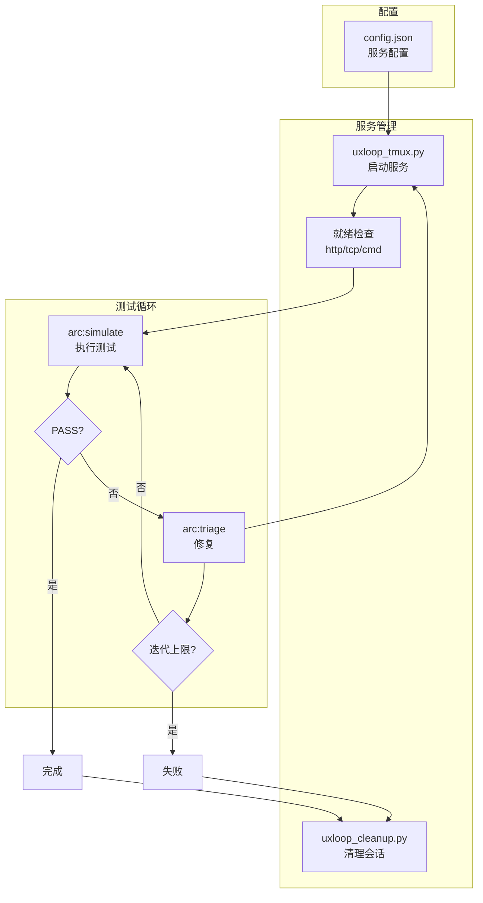

[根目录](../CLAUDE.md) > **loop**

# loop -- tmux 服务管理与回归闭环

## 变更记录 (Changelog)

| 时间 | 操作 |
|------|------|
| 2026-02-24T16:30:00 | arc:init 三模型协作生成模块级 CLAUDE.md |

## 模块职责

arc:loop 管理 tmux 会话启动/重启服务，循环执行 arc:simulate 进行回归测试，直到 PASS 或达到迭代上限。作为测试闭环的调度层，协调服务状态和测试执行。

核心能力：
- **服务编排**：通过 JSON 配置管理多个服务的启动和重启
- **tmux 会话管理**：多 pane 布局、日志 pipe、会话清理
- **迭代回归**：失败→修复→重启→再测的闭环调度
- **状态追踪**：记录每轮迭代的 run_id、git 版本、tmux 会话信息

## 入口与启动

### 入口文件

| 文件 | 用途 |
|------|------|
| `SKILL.md` | Skill 定义（权威规范） |
| `scripts/uxloop_tmux.py` | tmux 服务管理主脚本 |
| `scripts/uxloop_cleanup.py` | tmux 会话清理脚本 |
| `assets/uxloop.config.example.json` | 配置示例 |

### 启动命令

```bash
# 启动服务并等待就绪
python loop/scripts/uxloop_tmux.py --config path/to/config.json --reset-window --wait-ready

# 清理会话
python loop/scripts/uxloop_cleanup.py --session uxloop --window svc --kill-session
```

### 配置文件结构

```json
{
  "session_name": "uxloop",
  "window_name": "svc",
  "services": [
    {
      "name": "backend",
      "command": "npm run dev",
      "pane": 0,
      "ready_check": { "type": "http", "url": "http://localhost:3000/health", "timeout": 30 }
    },
    {
      "name": "frontend",
      "command": "npm run serve",
      "pane": 1,
      "ready_check": { "type": "tcp", "host": "localhost", "port": 8080, "timeout": 30 }
    }
  ],
  "log_dir": "logs/uxloop"
}
```

## 对外接口

### CLI 脚本接口

| 脚本 | 参数 | 说明 |
|------|------|------|
| `uxloop_tmux.py` | `--config`, `--reset-window`, `--wait-ready` | 启动/重启服务；`--reset-window` 重建窗口；`--wait-ready` 等待服务就绪 |
| `uxloop_cleanup.py` | `--session`, `--window`, `--kill-session` | 清理 tmux 会话；`--kill-session` 杀死整个会话 |

### Skill 调用接口

通过 Claude Code 调用：`/arc:loop`

输入参数：
- `config_path` (required): 配置文件路径
- `max_iterations` (optional): 最大迭代次数，默认 5
- `simulate_params` (optional): arc:simulate 参数

### 就绪检查类型

| 类型 | 参数 | 说明 |
|------|------|------|
| `http` | `url`, `timeout` | HTTP GET 请求返回 2xx |
| `tcp` | `host`, `port`, `timeout` | TCP 端口可连接 |
| `cmd` | `command`, `timeout` | Shell 命令返回 0 |

## 关键依赖

| 依赖 | 类型 | 版本 | 用途 |
|------|------|------|------|
| Python | 运行时 | >= 3.10 | 辅助脚本执行 |
| tmux | 外部 CLI | 必须 | 终端复用和进程管理 |
| arc:simulate | Skill | 必须 | E2E 测试执行 |
| arc:triage | Skill | 必须 | 失败修复 |

## 数据模型

### 配置模型

| 字段 | 类型 | 说明 |
|------|------|------|
| `session_name` | string | tmux 会话名 |
| `window_name` | string | tmux 窗口名 |
| `services` | array | 服务列表 |
| `services[].name` | string | 服务名称 |
| `services[].command` | string | 启动命令 |
| `services[].pane` | int | pane 编号 |
| `services[].ready_check` | object | 就绪检查配置 |
| `log_dir` | string | 日志目录 |

### 迭代记录

每次迭代生成：
- `run_id`: 测试运行标识
- `git_sha`: 当前代码版本
- `tmux_session`: tmux 会话信息
- `result`: PASS/FAIL
- `report_path`: 报告路径

## 架构图



## 测试与质量

### 测试策略

| 类型 | 说明 |
|------|------|
| 服务就绪验证 | 通过 http/tcp/cmd 检查确认服务可用 |
| 回归闭环 | 失败→修复→重启→再测的完整链路 |
| 资源清理 | 每轮结束后清理 tmux 会话 |

### 质量约束

1. **迭代上限**：必须设置最大迭代次数，避免无限循环
2. **资源控制**：测试结束后必须关闭 tmux 会话
3. **日志落盘**：服务日志必须写入文件，便于问题追踪

### 覆盖率

- 无自动化单元测试
- 质量保障依赖端到端回归测试

## 关联文件清单

| 文件 | 职责 |
|------|------|
| `SKILL.md` | Skill 定义（权威规范），含完整的执行流程和约束 |
| `scripts/uxloop_tmux.py` | tmux 服务管理主脚本 |
| `scripts/uxloop_cleanup.py` | tmux 会话清理脚本 |
| `assets/uxloop.config.example.json` | 配置文件示例 |
| `references/tmux-runbook.md` | tmux 操作手册 |

## 注意事项

1. **tmux 依赖**：
   - 必须预先安装 tmux
   - 确保 tmux 会话命名唯一，避免冲突

2. **服务启动顺序**：
   - 配置文件中的服务按 pane 编号顺序启动
   - 依赖关系通过就绪检查处理

3. **资源清理**：
   - 测试结束后务必调用 `uxloop_cleanup.py`
   - 避免遗留后台进程占用端口

4. **日志管理**：
   - 日志文件可能较大，定期清理
   - 使用 `pipe-pane` 将 tmux 输出落盘

5. **迭代上限**：
   - 默认最大迭代 5 次
   - 可通过 `max_iterations` 参数调整
