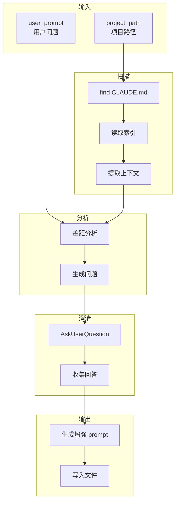

[根目录](../CLAUDE.md) > **refine**

# refine -- 问题细化器

## 变更记录 (Changelog)

| 时间 | 操作 |
|------|------|
| 2026-02-24T16:30:00 | arc:init 多Agent协作生成模块级 CLAUDE.md |

## 模块职责

arc:refine 是一个轻量级技能，用于扫描项目的 CLAUDE.md 层级索引，为模糊的用户 prompt 补充项目上下文。作为需求澄清的入口，帮助用户明确问题、补充背景、生成增强后的 prompt。

核心能力：
- **索引扫描**：读取项目 CLAUDE.md 层级结构，理解项目架构
- **差距分析**：对比用户 prompt 与项目上下文，识别缺失信息
- **交互澄清**：通过 AskUserQuestion 提出 1-4 个关键问题
- **Prompt 增强**：生成包含项目上下文的 enhanced-prompt.md

## 入口与启动

### 入口文件

| 文件 | 用途 |
|------|------|
| `SKILL.md` | Skill 定义（权威规范） |

### 调用方式

通过 Claude Code 调用：`/arc:refine`

输入参数：
- `user_prompt` (required): 用户的原始问题或需求描述
- `project_path` (required): 项目根目录路径
- `output_path` (optional): 增强 prompt 输出路径

### 工作流程

1. **扫描 CLAUDE.md 层级**：
   ```bash
   find . -name "CLAUDE.md" -type f
   ```

2. **读取项目上下文**：
   - 根级 CLAUDE.md：项目全貌、技术栈、运行命令
   - 模块级 CLAUDE.md：模块职责、接口、依赖

3. **差距分析**：
   - 对比用户 prompt 与项目上下文
   - 识别缺失的背景信息
   - 确定需要澄清的关键问题

4. **交互澄清**：
   - 使用 AskUserQuestion 提出 1-4 个关键问题
   - 收集用户回答

5. **生成增强 prompt**：
   - 合并原始 prompt、项目上下文、澄清结果
   - 输出到 `.arc/deliberate/<task-name>/context/enhanced-prompt.md`

## 对外接口

### Skill 调用接口

| 参数 | 类型 | 必填 | 说明 |
|------|------|------|------|
| `user_prompt` | string | 是 | 用户原始问题 |
| `project_path` | string | 是 | 项目根目录 |
| `output_path` | string | 否 | 输出路径（默认 `.arc/deliberate/<task>/context/`） |

### 输出产物

```markdown
# Enhanced Prompt

## 原始问题
<user_prompt>

## 项目上下文
<从 CLAUDE.md 提取的关键信息>

## 澄清结果
| 问题 | 回答 |
|------|------|
| ... | ... |

## 增强后的问题
<结合上下文和澄清后的问题描述>
```

## 关键依赖

| 依赖 | 类型 | 用途 |
|------|------|------|
| 项目 CLAUDE.md | 文件 | 项目上下文来源 |
| AskUserQuestion | 工具 | 交互式澄清 |

## 数据模型

### 差距分析模型

```markdown
# 差距分析

## 用户原始问题
<user_prompt>

## 已知上下文
- 项目类型: <从 CLAUDE.md 提取>
- 技术栈: <从 CLAUDE.md 提取>
- 相关模块: <从 CLAUDE.md 提取>

## 缺失信息
1. <缺失项1>
2. <缺失项2>

## 澄清问题
1. <问题1>
2. <问题2>
```

### 澄清问题约束

- 问题数量：1-4 个
- 问题类型：选择题（提供选项）或开放题
- 问题目的：补充关键背景信息

## 架构图



## 测试与质量

### 质量约束

1. **提问数量控制**：最多 4 个问题
2. **上下文相关性**：问题必须与项目上下文相关
3. **输出结构化**：增强 prompt 必须有清晰的结构

### 覆盖率

- 无自动化单元测试
- 质量保障依赖差距分析和澄清流程

## 关联文件清单

| 文件 | 职责 |
|------|------|
| `SKILL.md` | Skill 定义（权威规范） |

## 注意事项

1. **CLAUDE.md 依赖**：
   - 需要项目已有 CLAUDE.md 层级索引
   - 若无索引，可先使用 arc:init 生成

2. **提问控制**：
   - 最多提出 4 个问题
   - 问题应聚焦于关键缺失信息
   - 避免重复或冗余

3. **输出路径**：
   - 默认输出到 `.arc/deliberate/<task-name>/context/enhanced-prompt.md`
   - 可被 arc:deliberate 直接消费

4. **轻量级设计**：
   - 无外部工具依赖
   - 仅使用 find/grep/read 类操作
   - 快速响应，不涉及模型调用

5. **与其他 Skill 的关系**：
   - 输出被 arc:deliberate 消费
   - 可作为 arc:agent 路由的前置步骤
