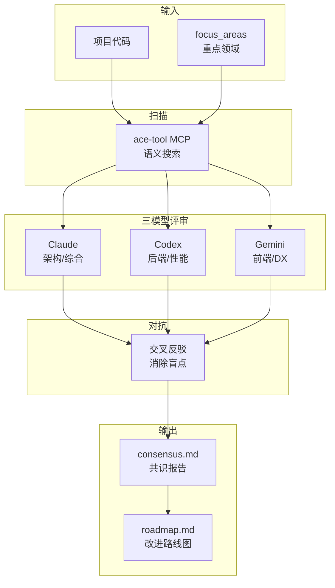

[根目录](../CLAUDE.md) > **review**

# review -- 企业级项目评审

## 变更记录 (Changelog)

| 时间 | 操作 |
|------|------|
| 2026-02-24T16:30:00 | arc:init 三模型协作生成模块级 CLAUDE.md |

## 模块职责

arc:review 按企业级七维度框架（ISO/IEC 25010 + TOGAF）深度评审软件项目，通过多Agent对抗式分析输出诊断报告与改进路线图。作为项目质量诊断的核心工具，适用于技术尽调、代码审计、架构评审等场景。

核心能力：
- **七维度框架**：功能适用性、性能效率、兼容性、易用性、可靠性、安全性、可维护性
- **多Agent对抗**：oracle/deep/momus 独立评审后互相反驳，消除盲点
- **证据驱动**：每个结论必须有代码路径、配置文件或日志证据支撑
- **改进路线图**：输出优先级排序的问题清单和修复建议

## 入口与启动

### 入口文件

| 文件 | 用途 |
|------|------|
| `SKILL.md` | Skill 定义（权威规范） |
| `references/dimensions.md` | 七维度评审框架详细定义 |

### 调用方式

通过 Claude Code 调用：`/arc:review`

输入参数：
- `project_path` (required): 待评审项目根目录
- `focus_areas` (optional): 重点评审领域，如 `["security", "performance"]`
- `output_format` (optional): 输出格式，默认 `markdown`

### 工作流程

1. **Phase 1: 项目扫描** — 使用 ace-tool MCP 扫描项目结构
2. **Phase 2: 多Agent独立评审** — oracle/deep/momus 各自从专业视角评审
3. **Phase 3: 交叉反驳** — 多Agent互相挑战对方结论
4. **Phase 4: 报告合成** — 汇总共识，标注分歧，输出最终报告

## 对外接口

### Skill 调用接口

| 参数 | 类型 | 必填 | 说明 |
|------|------|------|------|
| `project_path` | string | 是 | 待评审项目根目录 |
| `focus_areas` | array | 否 | 重点领域：security/performance/maintainability 等 |
| `depth` | string | 否 | 评审深度：quick/standard/deep |

### 输出产物

```
.arc/review/<project-name>/
├── claude/
│   ├── review.md           # Claude 评审报告
│   └── critique.md         # 对 Codex/Gemini 的反驳
├── codex/
│   ├── review.md           # Codex 评审报告
│   └── critique.md         # 对 Claude/Gemini 的反驳
├── gemini/
│   ├── review.md           # Gemini 评审报告
│   └── critique.md         # 对 Claude/Codex 的反驳
├── consensus.md            # 共识报告
├── roadmap.md              # 改进路线图
└── summary.md              # 执行摘要
```

## 关键依赖

| 依赖 | 类型 | 用途 |
|------|------|------|
| ace-tool MCP | 必须 | 语义搜索项目代码结构 |
| Exa MCP | 推荐 | 搜索最佳实践和漏洞信息 |
| codex CLI | 已移除 | 不再需要 |
| gemini CLI | 已移除 | 不再需要 |

## 数据模型

### 七维度框架

| 维度 | ISO/IEC 25010 映射 | 评审重点 |
|------|-------------------|---------|
| 功能适用性 | Functional Suitability | 功能完整性、正确性 |
| 性能效率 | Performance Efficiency | 响应时间、资源消耗 |
| 兼容性 | Compatibility | 互操作性、共存性 |
| 易用性 | Usability | 可理解性、可学习性 |
| 可靠性 | Reliability | 可用性、容错性 |
| 安全性 | Security | 机密性、完整性、抗抵赖 |
| 可维护性 | Maintainability | 模块化、可测试性 |

### 评审结论模型

```markdown
## <维度名>

### 发现
| 问题 | 严重程度 | 证据 | 建议 |
|------|---------|------|------|
| ... | 高/中/低 | file:line | ... |

### 亮点
| 优点 | 证据 |
|------|------|
| ... | file:line |
```

## 架构图



## 测试与质量

### 质量约束

1. **只读原则**：严禁修改被评审项目的源代码
2. **证据驱动**：每个结论必须有 `file:line` 证据
3. **反驳必答**：三模型必须回应对方的反驳

### 评审深度

| 深度 | 扫描范围 | 预计耗时 |
|------|---------|---------|
| quick | 关键目录和配置 | 10-15min |
| standard | 全项目结构 | 30-45min |
| deep | 全项目 + 依赖分析 | 60-90min |

### 覆盖率

- 无自动化单元测试
- 质量保障依赖三模型对抗机制

## 关联文件清单

| 文件 | 职责 |
|------|------|
| `SKILL.md` | Skill 定义（权威规范），含完整的评审流程 |
| `references/dimensions.md` | 七维度评审框架详细定义 |

## 注意事项

1. **只读边界**：
   - 严禁修改被评审项目源代码
   - 所有产出写入 `.arc/review/<project-name>/`

2. **证据驱动**：
   - 每个评审结论必须有 `file:line` 证据
   - 不得基于猜测或推断下结论

3. **模型协作**：
   - Claude 负责架构、综合分析
   - Codex 负责后端、性能、安全
   - Gemini 负责前端、DX、文档

4. **输出规范**：
   - consensus.md 必须标注分歧点
   - roadmap.md 必须有优先级排序

5. **敏感信息**：
   - 评审报告可能包含敏感信息
   - `.arc/` 目录应在 `.gitignore` 中
