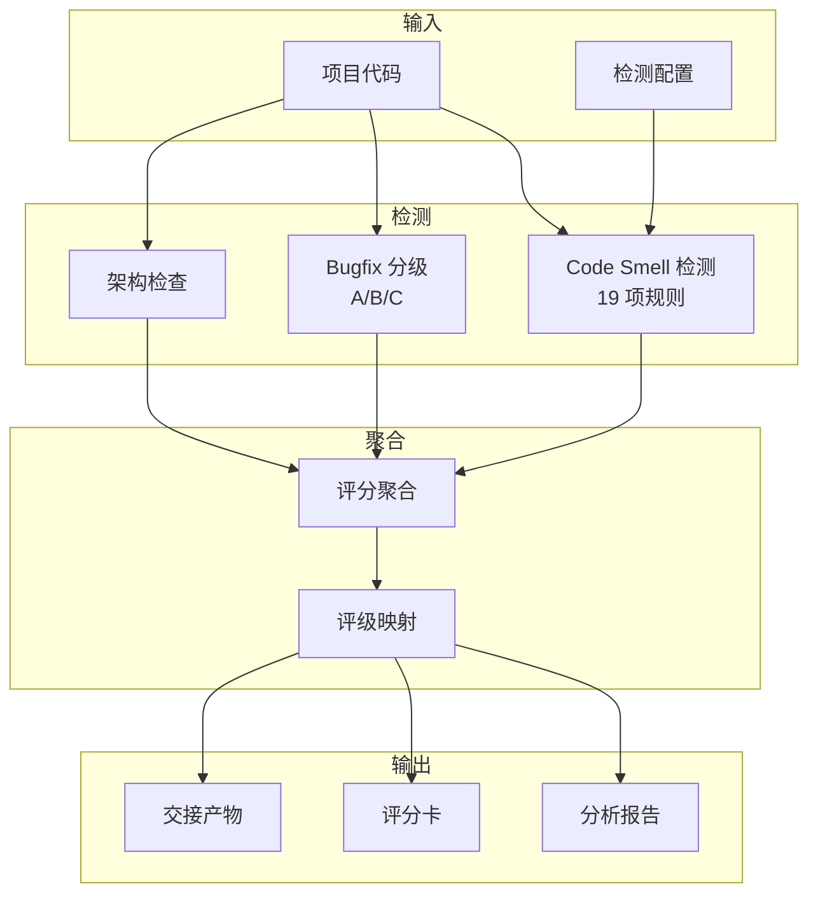

[根目录](../CLAUDE.md) > **score**

# score -- 量化评分与 Code Smell 检测

## 变更记录 (Changelog)

| 时间 | 操作 |
|------|------|
| 2026-03-03 | 初始版本，创建 arc:score 子模块 |

## 模块职责

arc:score 是量化评分子模块，通过静态分析检测 Code Smell、分析 Bugfix 历史分级、检查架构违规，输出量化评分数据供 arc:review 和 arc:gate 消费。

核心能力：
- **Code Smell 检测**：6 大类 19 项检测规则
- **Bugfix 分级**：A/B/C 分级 + 自动打标
- **架构检查**：模块依赖违规检测
- **评分聚合**：量化分数 (0-100) + 评级 (A-F)

## 入口与启动

### 入口文件

| 文件 | 用途 |
|------|------|
| `SKILL.md` | Skill 定义（权威规范） |
| `references/smell-rules.yaml` | Code Smell 检测规则 |
| `references/bugfix-grades.yaml` | Bugfix 分级规则 |

### 调用方式

通过 Claude Code 调用：`/arc:score`

输入参数：
- `project_path` (required): 待评分项目根目录
- `output_dir` (optional): 输出目录，默认 `.arc/score/<project-name>`
- `focus` (optional): 检测焦点数组
- `severity_threshold` (optional): 最低严重程度

### 工作流程

1. **Phase 1: 项目扫描** — 创建工作目录 + 语言检测
2. **Phase 2: Code Smell 检测** — 执行 19 项检测规则
3. **Phase 3: Bugfix 分级** — git log 分析 + A/B/C 分级
4. **Phase 4: 评分聚合** — 汇总评分 + 评级
5. **Phase 5: 生成报告** — 评分卡 + 交接产物

## 对外接口

### Skill 调用接口

| 参数 | 类型 | 必填 | 说明 |
|------|------|------|------|
| `project_path` | string | 是 | 待评分项目根目录 |
| `output_dir` | string | 否 | 输出目录 |
| `focus` | array | 否 | 检测焦点：smell/bugfix/architecture |
| `severity_threshold` | string | 否 | 最低严重程度 |

### 输出产物

```
.arc/score/<project-name>/
├── context/
│   └── project-snapshot.md
├── analysis/
│   ├── smell-report.json
│   ├── smell-report.md
│   ├── bugfix-grades.json
│   └── architecture-check.json
├── score/
│   ├── overall-score.json
│   ├── dimension-scores.json
│   └── scorecard.md
└── handoff/
    └── review-input.json
```

## 关键依赖

| 依赖 | 类型 | 用途 |
|------|------|------|
| ace-tool MCP | 必须 | 项目扫描和语言检测 |
| Python 3.10+ | 必须 | 脚本执行环境 |
| tree-sitter | 可选 | AST 解析（增强检测） |

## 数据模型

### Code Smell 规则模型

```yaml
- id: structural_duplication
  category: duplication
  name: 结构重复
  severity: medium
  threshold: 0.8
  description: 多个函数结构相同，仅变量名不同
```

### 评分模型

```json
{
  "score": 75,
  "grade": "C",
  "total_penalty": 25,
  "by_category": {...},
  "by_severity": {...}
}
```

## 架构图



## 测试与质量

### 质量约束

1. **本地运行**：无需外部服务依赖
2. **增量支持**：支持增量扫描
3. **可配置**：规则、阈值均可配置
4. **双格式输出**：JSON + Markdown

### 支持语言

| 语言 | Code Smell | Bugfix 分级 |
|------|-----------|------------|
| Python | ✅ | ✅ |
| TypeScript | ✅ | ✅ |
| JavaScript | ✅ | ✅ |
| Go | ✅ | ✅ |
| Rust | 部分 | ✅ |
| Java | 部分 | ✅ |

## 关联文件清单

| 文件 | 职责 |
|------|------|
| `SKILL.md` | Skill 定义（权威规范） |
| `scripts/scaffold_score_case.py` | 创建工作目录 |
| `scripts/detect_smell.py` | Code Smell 检测 |
| `scripts/grade_bugfix.py` | Bugfix 分级 |
| `scripts/aggregate_score.py` | 评分聚合 |
| `scripts/generate_review_handoff.py` | 生成 review 交接产物 |
| `scripts/validate_score_artifacts.py` | 校验 score 产物契约 |
| `scripts/smoke_test_integration.py` | 最小集成自测（score→review/gate） |
| `references/smell-rules.yaml` | 检测规则定义 |
| `references/bugfix-grades.yaml` | 分级规则定义 |

## 注意事项

1. **性能考虑**：
   - 大型项目使用增量扫描
   - AST 解析可选择性启用

2. **误报处理**：
   - 提供规则配置，允许禁用特定规则
   - 支持豁免清单

3. **语言支持**：
   - 优先支持主流语言
   - 新语言支持需扩展检测规则
