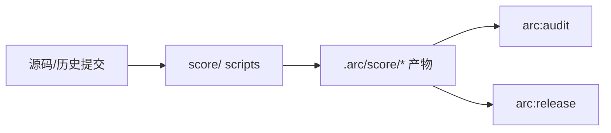

[根目录](../CLAUDE.md) > **score**

# score -- 内部量化评分模块

## 变更记录 (Changelog)

| 时间 | 操作 |
|------|------|
| 2026-03-03 | 初始版本，建立 score 评分模块；`arc:score` 对外入口收敛到 `arc:release` |

## 模块定位

`score/` 是 **评分层（Scoring Layer）**，只负责产出量化数据，不做发布阻断判定。

- 输入：项目源码、历史提交、规则配置
- 输出：`smell-report.json`、`bugfix-grades.json`、`overall-score.json`、`handoff/review-input.json`
- 消费方：`arc:audit`、`arc:release`

> 语义边界：  
> - `score/`：回答“质量分数是多少、问题有哪些”  
> - `arc:release`：回答“是否允许合并/发布”

## 目录与产物

```
score/
├── scripts/
├── references/
└── templates/
```

运行后产物目录（目标项目内）：

```
.arc/score/<project-name>/
├── context/
├── analysis/
├── score/
└── handoff/
```

## 核心脚本

| 文件 | 职责 |
|------|------|
| `scripts/scaffold_score_case.py` | 创建 `.arc/score/<project>/` 结构 |
| `scripts/detect_smell.py` | 代码异味扫描 |
| `scripts/grade_bugfix.py` | Bugfix 历史分级 |
| `scripts/aggregate_score.py` | 聚合总分与维度分 |
| `scripts/generate_review_handoff.py` | 生成 review 可消费交接 |
| `scripts/validate_score_artifacts.py` | 校验 score 产物契约 |
| `scripts/smoke_test_integration.py` | 最小集成冒烟（score→review/gate） |

## 运行关系



## 约束

1. 评分模块不得直接输出 Go/No-Go 结论。
2. `producer_skill` 字段保持稳定，保障旧工件兼容。
3. 规则与阈值优先放在 `references/`，避免硬编码分散。
