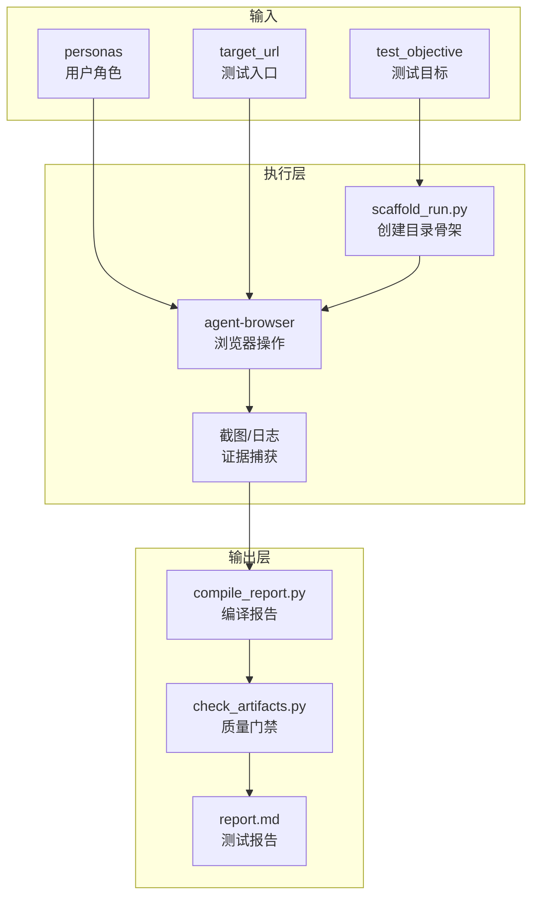

[根目录](../CLAUDE.md) > **simulate**

# simulate -- E2E 浏览器自动化测试

## 变更记录 (Changelog)

| 时间 | 操作 |
|------|------|
| 2026-02-24T16:30:00 | arc:init 三模型协作生成模块级 CLAUDE.md |

## 模块职责

arc:simulate 赋予 Agent "高级自动化测试工程师"的能力，通过 `agent-browser` 工具模拟真实用户操作无头浏览器，执行端到端（E2E）业务流测试。

核心能力：
- **拟人化操作**：模拟点击、输入、等待，禁止绕过 UI 直接调用 API
- **多角色切换**：支持跨账���测试场景，自动处理登录/登出
- **证据链管理**：自动截图、记录操作日志、生成结构化报告
- **数据层验证**：可选的 Docker 容器数据库只读验证

## 入口与启动

### 入口文件

| 文件 | 用途 |
|------|------|
| `SKILL.md` | Skill 定义（权威规范） |
| `scripts/scaffold_run.py` | 创建测试运行目录骨架 |
| `scripts/compile_report.py` | 编译 JSONL 为 Markdown 报告 |
| `scripts/check_artifacts.py` | 质量门禁校验 |

### 启动命令

```bash
# 1. 创建测试运行目录
python simulate/scripts/scaffold_run.py --run-dir reports/2026-02-24_10-00-00_test1 --pack e2e

# 2. 执行测试（通过 agent-browser CLI）
agent-browser open "https://example.com/login"
agent-browser type "#username" "testuser"
agent-browser type "#password" "secret123"
agent-browser click "#btn-submit"
agent-browser screenshot "reports/2026-02-24_10-00-00_test1/screenshots/s0001_login.png"

# 3. 编译报告
python simulate/scripts/compile_report.py --run-dir reports/2026-02-24_10-00-00_test1

# 4. 校验产物
python simulate/scripts/check_artifacts.py --run-dir reports/2026-02-24_10-00-00_test1 --strict
```

### Python 环境

```bash
# 可选：安装报告美化依赖（建议在 venv 中）
pip install -r simulate/requirements.txt
```

## 对外接口

### CLI 脚本接口

| 脚本 | 参数 | 说明 |
|------|------|------|
| `scaffold_run.py` | `--run-dir`, `--pack` | 创建运行目录骨架；pack 可选 `e2e`/`full-process` |
| `compile_report.py` | `--run-dir`, `--in-place`, `--table-backend` | 编译 JSONL 为 Markdown；table-backend 可选 `tabulate`/`pandas`/`py-markdown-table` |
| `check_artifacts.py` | `--run-dir`, `--strict` | 质量门禁；`--strict` 启用严格模式 |
| `beautify_md.py` | `--run-dir` | 使用 mdformat 格式化 Markdown |
| `new_defect.py` | `--run-dir`, `--title`, `--step`, `--evidence` | 生成缺陷报告 |
| `accounts_to_personas.py` | `--accounts-file` | 将 accounts.jsonc 转换为 personas JSON |

### Skill 调用接口

通过 Claude Code 调用：`/arc:simulate`

输入参数（在上下文中提供）：
- `test_objective` (required): 测试目标描述
- `personas` (required): 用户角色和凭证列表
- `target_url` (required): 测试环境入口 URL
- `validation_container` (optional): Docker 容器名称（数据验证）
- `run_id` (optional): 运行标识

## 关键依赖

| 依赖 | 类型 | 版本 | 用途 |
|------|------|------|------|
| ace-tool MCP | 外部工具 | 必须 | 读取项目源码、获取页面选择器 |
| agent-browser | 外部 CLI | 必须 | 浏览器自动化操作 |
| docker | 外部 CLI | 可选 | 数据库只读验证 |
| Python | 运行时 | >= 3.10 | 辅助脚本执行 |
| mdformat | Python 包 | 最新 | Markdown 格式化（可选） |
| tabulate | Python 包 | 最新 | 表格生成（可选） |
| pandas | Python 包 | 最新 | 数据处理（可选） |

## 数据模型

### 输入数据

| 文件 | 格式 | 说明 |
|------|------|------|
| `accounts.jsonc` | JSONC | 账号凭证存储（含 role/user/pass/token） |

### 输出产物

```
reports/<run_id>/
├── accounts.jsonc          # 本次测试使用的账号
├── report.md               # 主测试报告
├── action-log.md           # 操作日志
├── screenshot-manifest.md  # 截图清单
├── events.jsonl            # 机器可读事件流（可选）
├── screenshots/            # 截图目录
│   ├── s0001_*.png
│   └── ...
├── failures/               # 失败报告（仅失败时）
│   └── failure-0001.md
└── db/                     # 数据库验证（可选）
    ├── query-0001.txt
    └── result-0001.txt
```

### 事件模型 (events.jsonl)

```json
{"run_id":"xxx","step":1,"role":"buyer","kind":"exec","cmd":"agent-browser open ...","ts":"...","result":"PASS"}
{"run_id":"xxx","step":1,"role":"buyer","kind":"screenshot","path":"screenshots/...","description":"...","ts":"..."}
```

## 架构图



## 测试与质量

### 测试策略

| 类型 | 说明 |
|------|------|
| E2E 产物校验 | `check_artifacts.py --strict` 校验必需文件、截图引用、JSONL 解析、Markdown 表格 |
| Markdown 格式 | `mdformat --check` 或内置校验逻辑 |
| 回归验证 | 配合 `arc:loop` 和 `arc:triage` 形成闭环 |

### 质量门禁

`check_artifacts.py --strict` 校验项：
1. 必需文件存在性（report.md, action-log.md, screenshot-manifest.md, accounts.jsonc）
2. 截图引用一致性（manifest 与实际文件对应）
3. JSONL 可解析性
4. Markdown 表格列数对齐

### 覆盖率

- 无自动化单元测试
- 质量保障依赖产物校验和人工评审

## 关联文件清单

| 文件 | 职责 |
|------|------|
| `SKILL.md` | Skill 定义（权威规范），含完整的执行流程和铁律 |
| `requirements.txt` | Python 依赖清单（可选安装） |
| `scripts/scaffold_run.py` | 创建测试运行目录骨架和模板文件 |
| `scripts/compile_report.py` | 从 JSONL 编译 Markdown 报告 |
| `scripts/check_artifacts.py` | 质量门禁校验 |
| `scripts/beautify_md.py` | Markdown 格式化工具 |
| `scripts/new_defect.py` | 生成缺陷报告 |
| `scripts/accounts_to_personas.py` | 账号格式转换 |
| `templates/` | 报告模板目录 |
| `examples/` | 脚手架示例和用法示例 |

## 注意事项

1. **敏感信息安全**：
   - `reports/` 目录包含明文密码，已在 `.gitignore` 中排除
   - 严禁将测试报告提交到代码仓库

2. **Markdown 表格校验**：
   - 生成报告后必须运行 `check_artifacts.py --strict`
   - 表格列数不一致会导致解析失败

3. **拟人化操作原则**：
   - 禁止绕过 UI 直接调用 API
   - 必须模拟点击和输入操作

4. **资源控制**：
   - 所有等待/重试必须有上限
   - 测试结束后关闭浏览器和后台进程
