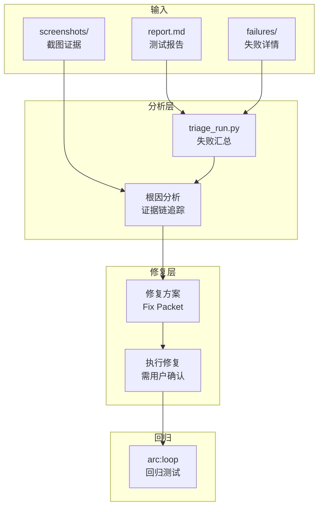

[根目录](../CLAUDE.md) > **triage**

# triage -- 缺陷分析与修复执行

## 变更记录 (Changelog)

| 时间 | 操作 |
|------|------|
| 2026-02-24T16:30:00 | arc:init 三模型协作生成模块级 CLAUDE.md |

## 模块职责

arc:triage 读取 arc:simulate 的失败报告，定位根因、执行修复、验证回归。作为测试闭环的核心环节，负责将失败转化为可交付的修复方案。

核心能力：
- **失败分析**：解析测试报告，定位失败步骤和根因
- **证据链追踪**：关联截图、日志、数据库状态
- **修复执行**：在获得用户确认后执行���码修复
- **回归验证**：配合 arc:loop 形成修复-验证闭环

## 入口与启动

### 入口文件

| 文件 | 用途 |
|------|------|
| `SKILL.md` | Skill 定义（权威规范） |
| `scripts/triage_run.py` | 快速汇总 run_dir 的失败信息 |

### 启动命令

```bash
# 快速生成失败汇总
python triage/scripts/triage_run.py reports/2026-02-24_10-00-00_test1

# 指定输出路径
python triage/scripts/triage_run.py reports/2026-02-24_10-00-00_test1 --md-out triage-summary.md --json-out triage-summary.json
```

### 工作流程

1. 读取 `reports/<run_id>/report.md` 和 `failures/`
2. 分析失败步骤，定位根因
3. 生成修复方案（Fix Packet）
4. 用户确认后执行修复
5. 调用 arc:loop 执行回归测试

## 对外接口

### CLI 脚本接口

| 脚本 | 参数 | 说明 |
|------|------|------|
| `triage_run.py` | `<run_dir>`, `--md-out`, `--json-out` | 生成失败汇总报告 |

### Skill 调用接口

通过 Claude Code 调用：`/arc:triage`

输入参数：
- `run_dir` (required): 测试运行目录路径
- `auto_fix` (optional): 是否自动执行修复（默认需用户确认）

### 与其他 Skill 的交互

| 交互方向 | Skill | 数据流 |
|---------|-------|--------|
| 输入 | arc:simulate | 读取 `reports/<run_id>/` 的失败报告 |
| 输出 | arc:loop | 触发回归测试 |

## 关键依赖

| 依赖 | 类型 | 版本 | 用途 |
|------|------|------|------|
| Python | 运行时 | >= 3.10 | 辅助脚本执行 |
| git | 外部 CLI | 必须 | 读取版本状态、执行回滚 |
| ace-tool MCP | 外部工具 | 必须 | 搜索项目源码定位问题 |

## 数据模型

### 输入数据

| 文件 | 来源 | 说明 |
|------|------|------|
| `report.md` | arc:simulate | 测试报告 |
| `failures/failure-XXXX.md` | arc:simulate | 失败详情 |
| `screenshots/*.png` | arc:simulate | 失败截图 |
| `events.jsonl` | arc:simulate | 操作事件流 |

### 输出产物

| 文件 | 说明 |
|------|------|
| `triage.md` | 失败汇总报告 |
| `triage.json` | 机器可读汇总 |
| Fix Packet | 修复方案（含修改文件列表、变更说明） |

### Fix Packet 结构

```markdown
# Fix Packet: <failure-id>

## 根因分析
<根因描述>

## 修复方案
1. <修改步骤1>
2. <修改步骤2>

## 受影响文件
- `path/to/file1`
- `path/to/file2`

## 验证步骤
1. <验证步骤1>
2. <验证步骤2>
```

## 架构图



## 测试与质量

### 测试策略

| 类型 | 说明 |
|------|------|
| 回归验证 | 修复后必须通过 arc:loop 回归测试 |
| 证据链完整 | 每个修复步骤必须有截图或日志证据 |

### 质量约束

1. **禁止绕过权限验证**：不允许通过修改代码跳过鉴权/授权
2. **必须输出 DEBUG 日志**：所有分析和修复步骤必须记录
3. **修复需用户确认**：除非 `auto_fix=true`，否则需用户批准

### 覆盖率

- 无自动化单元测试
- 质量保障依赖回归测试闭环

## 关联文件清单

| 文件 | 职责 |
|------|------|
| `SKILL.md` | Skill 定义（权威规范），含完整的执行流程和约束 |
| `scripts/triage_run.py` | 快速汇总 run_dir 的失败信息 |
| `references/decision-tree.md` | 缺陷分类决策树 |
| `references/fix-packet-template.md` | Fix Packet 模板 |

## 注意事项

1. **禁止绕过权限**：
   - 不允许通过修改代码跳过鉴权/授权验证
   - 所有权限相关修复必须通过正规流程

2. **证据驱动**：
   - 每个分析结论必须有截图、日志或数据库查询结果支撑
   - 不得猜测或推断根因

3. **回归闭环**：
   - 修复后必须执行回归测试
   - 回归失败需重新进入 triage 流程

4. **工作目录隔离**：
   - 输出产物写入源 run_dir，不创建独立工作目录
